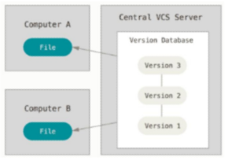
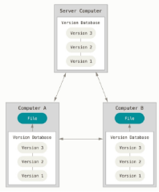

# GIT; 버전 관리 시스템

## 분산 버전 관리 시스템

### 버전 관리 : 변화를 기록하고 추적하는 것
- 각 버전은 이전 버전으로부터의 **변경사항**을 기록하고 있음
- 예를 들어 버전3은 전체 내용을 모두 포함하고 있지 않음

기존 - 지붕 -> 지붕+외벽 -> 지붕+외벽+창문 -> 지붕+외벽+창문+문 -> 집 완성
개선 - 지붕 -> 외벽 -> 창문 -> 문 -> 집 완성

### 분산
#### 중앙 vs 분산
- 중앙 집중식
  - 버전은 중앙 서버에 저장되고 중앙 서버에서 파일을 가져와 다시 중앙에 업로드
  - 보안 문제 컴터에 불나면 A, B는 최종 origianl 작업물만 가지고 있음 버전은 다 날라가버림
  
  - A에서 A 수정, B에서 A 수정 -> 합치는 과정에서 충돌 --- 관리 불가

- 분산식
  - 버전을 여러 개의 복제된 저장소에 저장 및 관리
  - 버전 정보 관리
  - 숨김폴더.git에서 파일 형태로 ver1~ver4까지의 변경 내용 저장
  
  - A에서 A 수정, B에서 A 수정 버전으로써 기록 -> 합치는 과정에서 충돌은 되지만 원본을 해치진 않음

- 분산 구조의 장점
  - 중앙 서버에 의존하지 않고도 동시에 다양한 작업을 수행할 수 있음
    * 개발자들 간의 작업 충돌을 줄여주고 개발 생산성을 향상
  - 중앙 서버의 장애나 손실에 대비하여 백업과 복구가 용이
  - 인터넷에 연결되지 않은 환경에서도 작업을 계속할 수 있음
    * 변경 이력과 코드를 로컬 저장소에 기록하고, 나중에 중앙 서버와 동기화

## git의 역할
- 코드의 버전(히스토리)를 관리
- 개발되어 온 과정 파악
- 이전 버전과의 변경 사항 비교
- 코드의 '변경 이력'을 기록하고 '협업'을 원활하게 하는 도구

## git의 영역

### Working Directory

### Staging Area

### Repository
버전 이력과 파일들이 영구적으로 저장되는 영역
모든 버전과 변경 이력이 기록됨

`git init` : (master) 생성, 폴더 숨김 항목에 .git 폴더 생성 git으로 관리를 하겠다


```bash
On branch master

No commits yet

Changes to be committed:
  (use "git rm --cached <file>..." to unstage)
        new file:   00_startcamp/01_git/markdown.md

Untracked files:
  (use "git add <file>..." to include in what will be committed)
        00_startcamp/01_git/CLI.md
        00_startcamp/01_git/GIT.md
        00_startcamp/01_git/image-1.png
        00_startcamp/01_git/image.png
```

```bash
$ git commit -m "마크다운 연습"
[master (root-commit) 66bd96f] 마크다운 연습
 1 file changed, 53 insertions(+)
 create mode 100644 00_startcamp/01_git/markdown.md
```


stra--- -> repository로 넘어감

이 컴퓨터에서 git config 설정해두면 다른 폴더 git init 하고 git config 한 번 더 할 필요 없음

- git은 로컬 저장소 내 모든 파일의 **'변경사항'**을 감사히고 있다.

### 원격 저장소
코드와 버전 관리 이력을 온라인 상의 특정 위치에 저장하여 여러 개발자가 협업하고 코드를 공유할 수 있는 저장 공간

Add a README file -> 


`echo` 내용 추가해서 파일 생성한다
`git remote add origin https://github.com/gahuily/TIL`
원격 저장소 추가할 건데 앞으로 origin이라 부를 거고 주소는 http~다.

`git push -u origin master` - 

시작
`init
작업
add
commit`
push - 싸피에서 작업한 내용 업데이트
집
pull - 집에서 싸피 작업 내용 다운로드(반영)
작업
add
commit
push - 집에서 작업한 변경 내용 업데이트
pull - 변경된 내용 싸피에서 반영

```bash
$ git add 파일명.확장자
$ git commit -m "작업명"
# Please tell me who you are 뜨는 경우
$ git config --global user.email "이메일"
$ git config --global user.name "이름"
$ git commit -m "작업명" # 에러 해결 후 다시 시도
$ git push # 작업내용을 깃허브에 저장
```