# GIT; 버전 관리 시스템

## 분산 버전 관리 시스템

### 버전 관리 : 변화를 기록하고 추적하는 것
- 각 버전은 이전 버전으로부터의 **변경사항**을 기록하고 있음
- 예를 들어 버전3은 전체 내용을 모두 포함하고 있지 않음

기존 - 지붕 -> 지붕+외벽 -> 지붕+외벽+창문 -> 지붕+외벽+창문+문 -> 집 완성
개선 - 지붕 -> 외벽 -> 창문 -> 문 -> 집 완성

### 분산
#### 중앙 vs 분산
- 중앙 집중식
  - 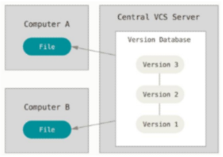
  - 버전은 중앙 서버에 저장되고 중앙 서버에서 파일을 가져와 다시 중앙에 업로드
  - 보안 문제 컴터에 불나면 A, B는 최종 origianl 작업물만 가지고 있음 버전은 다 날라가버림
  - A에서 A 수정, B에서 A 수정 -> 합치는 과정에서 충돌 --- 관리 불가

- 분산식
  - 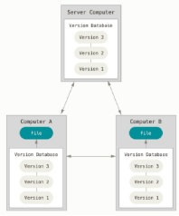
  - 버전을 여러 개의 복제된 저장소에 저장 및 관리
  - 버전 정보 관리
  - 숨김폴더.git에서 파일 형태로 ver1~ver4까지의 변경 내용 저장
  - A에서 A 수정, B에서 A 수정 버전으로써 기록 -> 합치는 과정에서 충돌은 되지만 원본을 해치진 않음

- 분산 구조의 장점
  - 중앙 서버에 의존하지 않고도 동시에 다양한 작업을 수행할 수 있음
    * 개발자들 간의 작업 충돌을 줄여주고 개발 생산성을 향상
  - 중앙 서버의 장애나 손실에 대비하여 **백업과 복구**가 용이
  - 인터넷에 연결되지 않은 환경에서도 작업을 계속할 수 있음
    * 변경 이력과 코드를 로컬 저장소에 기록하고, 나중에 중앙 서버와 동기화

## GIT의 역할
- 코드의 버전(히스토리)를 관리
- 개발되어 온 과정 파악
- 이전 버전과의 변경 사항 비교
- 코드의 '변경 이력'을 기록하고 '협업'을 원활하게 하는 도구

## GIT의 영역

### Working Directory
- 실제 작업 중인 파일들이 위치하는 영역

### Staging Area
- Working Directory에서 변경된 파일 중, 다음 버전에 포함시킬 파일들을 선택적으로 추가하거나 제외할 수 있는 중간 준비 영역

### Repository
- **버전(commit)** 이력과 파일들이 영구적으로 저장되는 영역
- 모든 **버전(commit)**과 변경 이력이 기록됨
#### Commit(버전)
- 변경된 파일들을 저장하는 행위(사진 기록처럼 여겨 'snapshot'이라고도 함)

## GIT의 동작

### `git init`
: 로컬 저장소 설정(초기화)
- git의 버전 관리를 시작할 디렉토리에서 진행
- git의 관리를 받기 시작한 디렉토리 경로 옆 (master) 생성
- 폴더 숨김 항목에 .git 폴더 생성 git으로 관리하겠다 선언
- 주의사항
  - git 로컬 저장소 내에 또 다른 git 로컬 저장소를 만들지 말 것
    * 즉, 이미 git 로컬 저장소인 디렉토리 내부 하단에서 git init 명령어를 다시 입력하지 말 것
  - git 저장소 안에 git 저장소가 있을 경우 가장 바깥 쪽의 git 저장소가 안쪽의 git 저장소의 변경사항을 추적할 수 없기 때문

### `git add`
: 변경사항이 있는 파일을 staging area에 추가

### `git commit`
: staging area에 있는 파일들을 저장소에 기록
- 해당 시점의 버전을 생성하고 변경 이력을 남기는 것

### `git status`
: 로컬 저장소의 파일 상태 확인

### `git log`
: commit history 확인

### `git log --online`
: commit 목록 한 줄로 보기

### `git config --global -l`
: git global 설정 정보 보기

### `git remote add origin "경로"`
: 로컬 저장소에 원격 저장소 추가
- `origin`: 추가하는 원격 저장소 별칭
  - 별칭을 사용해 로컬 저장소 한 개에 여러 원격 저장소를 추가할 수 있음
- `"경로"`: 추가하는 원격 저장소의 URL

### `git remote -v`
: 등록된 원격 저장소 목록 확인

### `git push origin master`
: 원격 저장소에 commit 목록을 업로드
- "origin이라는 이름의 원격 저장소에 master라는 이름의 branch를 push해줘."
- 최초 push 시, GitHub으로부터 인증서(git credential) 발급 필요
  - 해당 원격 저장소에 push할 수 있는 권한이 있는지 확인하기 위함

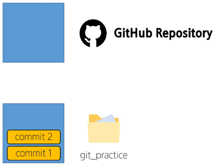
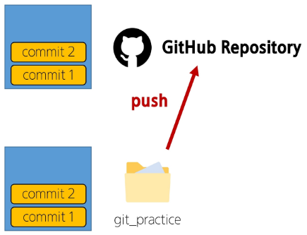
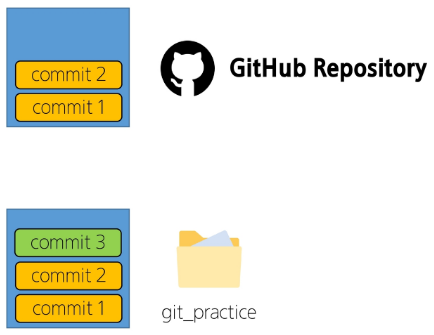
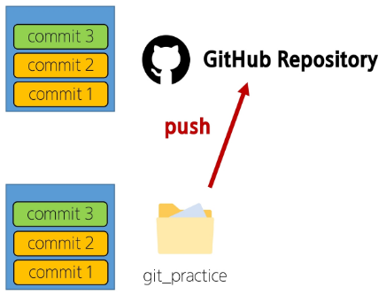

#### 원격 저장소에는 commit이 올라가는 것
- commit 이력이 없다면 push 할 수 없다.

### `git pull origin master`
: 원격 저장소의 변경사항만을 받아옴 (업데이트)

### `git clone remote_repo_url`
: 원격 저장소 전체를 복제 (다운로드)
- clone으로 받은 프로젝트는 이미 git init이 되어 있음

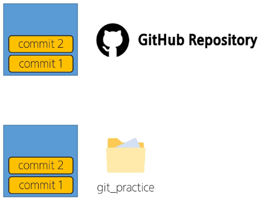
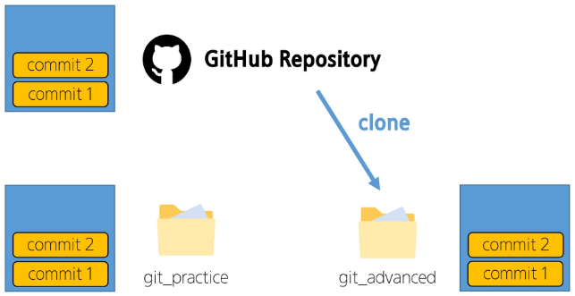
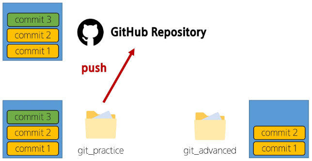
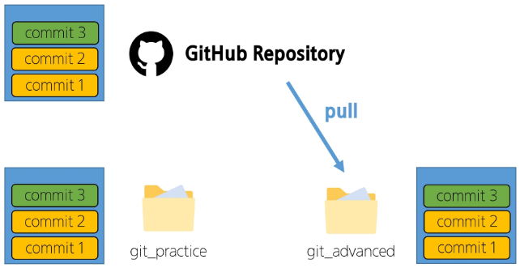


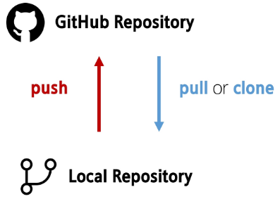


```bash
$ git status
```
```bash
Untracked files:
  (use "git add <file>..." to include in what will be committed)
        sam.txt
```

```bash
$ git add sam.txt
$ git status
```
```bash
Changes to be committed:
  (use "git restore --staged <file>..." to unstage)
        new file:   sam.txt
```
```bash
$ git commit -m "GIT 복습 위한 재생성"
```
```bash
*** Please tell me who you are.

Run

  git config --global user.email "you@example.com"
  git config --global user.name "Your Name"
```
- commit을 생성하기 위해서는 commit 작성자 정보가 필요
- global로 설정 후 앞으로 재입력하지 않음

```bash
$ git config --global user.email "이메일"
$ git config --global user.name "이름"
```

- commit 생성하기 재시도
```bash
$ git commit -m "GIT 복습 위해 sam.txt"
```

- commit 목록 확인
```bash
$ git log
```
```bash
commit bd85bab61adb167f5fe786fe79748ed836633347 (HEAD -> master)
Author: 한가희 <jess5858@naver.com>
Date:   Thu Jul 17 13:26:58 2025 +0900

    GIT 복습 위해 sam.txt
```


- 로컬 저장소의 파일 상태 확인
```bash
$ git status
On branch master
Your branch is ahead of 'origin/master' by 3 commits.
  (use "git push" to publish your local commits)

Changes not staged for commit:
  (use "git add/rm <file>..." to update what will be committed)
  (use "git restore <file>..." to discard changes in working directory)
        deleted:    sample.txt

no changes added to commit (use "git add" and/or "git commit -a")
```

- sam.txt에 변경사항을 만든 뒤 저장 - 로컬 저장소의 파일 상태 확인
```bash
$ git status
On branch master
Your branch is ahead of 'origin/master' by 3 commits.
  (use "git push" to publish your local commits)

Changes not staged for commit:
  (use "git add/rm <file>..." to update what will be committed)
  (use "git restore <file>..." to discard changes in working directory)
        modified:   sam.txt
        deleted:    sample.txt

no changes added to commit (use "git add" and/or "git commit -a")
```

```bash
$ git commit -m "GIT 복습 위해 sam.txt 수정"
```
```bash
[master 975d33d] GIT 복습 위해 sam.txt 수정
 1 file changed, 1 insertion(+)
```
**git은 로컬 저장소 내 모든 파일의 '변경사항'을 감시하고 있다.**


```bash
```
```bash
```
```bash
```
```bash
```

### 로컬(local)
현재 사용자가 직접 접속하고 있는 기기 또는 시스템
개인 컴퓨터, 노트북, 태블릿 등 사용자가 직접 조작하는 환경


```bash
$ git commit -m "마크다운 연습"
[master (root-commit) 66bd96f] 마크다운 연습
 1 file changed, 53 insertions(+)
 create mode 100644 00_startcamp/01_git/markdown.md
```


stra--- -> repository로 넘어감

이 컴퓨터에서 git config 설정해두면 다른 폴더 git init 하고 git config 한 번 더 할 필요 없음

- git은 로컬 저장소 내 모든 파일의 **'변경사항'**을 감사히고 있다.

### 원격 저장소(Remote Repository)
코드와 버전 관리 이력을 온라인 상의 특정 위치에 저장하여 여러 개발자가 협업하고 코드를 공유할 수 있는 저장 공간
- ex) GitLab, GitHub, Bitbucket

Add a README file -> 


`echo` 내용 추가해서 파일 생성한다
`git remote add origin https://github.com/gahuily/TIL`
원격 저장소 추가할 건데 앞으로 origin이라 부를 거고 주소는 http~다.

`git push -u origin master` - 

시작
`init
작업
add
commit`
push - 싸피에서 작업한 내용 업데이트
집
pull - 집에서 싸피 작업 내용 다운로드(반영)
작업
add
commit
push - 집에서 작업한 변경 내용 업데이트
pull - 변경된 내용 싸피에서 반영

```bash
$ git add 파일명.확장자
$ git commit -m "작업명"
# Please tell me who you are 뜨는 경우
$ git config --global user.email "이메일"
$ git config --global user.name "이름"
$ git commit -m "작업명" # 에러 해결 후 다시 시도
$ git push # 작업내용을 깃허브에 저장
```


로컬과 원격 저장소의 commit 목록이 다르면 push 못함
pull은 가능 (원격->로컬)

### 깃 branch 과정
git branch -c gahui
git switch gahui
git add .
git commit -m ""
git push origin gahui
(gitlab에서 merge)
(다시 돌아와서)
git pull
git branch -d gahui

두 branch에서 동시에 같은 파일 작업하여 충돌 생겼을 경우,
`git pull` # 최신화한 후 내 branch에서 merge 작업
`git switch gahui`
`git merge master` # 내 작업 환경에 master 내용을 merge
`git add .`
`git commit -m ""`
`git push origin gahui`
내 branch에서 수정 후 충돌 없게 merge request
마지막으로 master에서 최신화(git pull)까지 해야 완성

### RULE
1. master branch는 아무도 수정하지 않는다.
2. master branch는 최초 설정 (모든 팀원이 함께 쓸 내용 생성 시만 사용)
- git add . / git commit / push 까지 모두 진행
3. develop (혹은 dev) branch 생성한다.