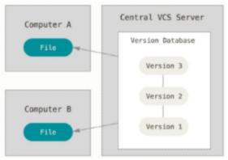

<<<<<<< HEAD
=======
# 마크다운
- 볼드체는 **dd**
```python
print('hello') # 코드 블럭 처리
```
[링크](www.naver.com) # 링크 설정


# 마크다운

## heading
# 대주제
## 중주제
### 소주제
#### 개수에 따라서 다르게 나타남

>>>>>>> e904851 (마크다운 연습)
---
---
---

1. 순서가 있는 리스트
2. 값을 적으면 된다.
    1. 어떠한 내용
<<<<<<< HEAD
    2. 중첩된 순서가 있는 리스트.
=======
    2. 중첩된 순서가 있는 리스트
>>>>>>> e904851 (마크다운 연습)
    - 순서가 없는 리스트를 더 자주 쓸 듯?

- depth에 따라 표기 방법도 달라짐
  - 이렇게요

[링크 텍스트](www.naver.com)

<<<<<<< HEAD
- 코드 블럭
```python
print('hello')
=======
```python
print('hello') # 코드 블럭 처리
>>>>>>> e904851 (마크다운 연습)
```
```bash
$ mkdir test
```
```javascript
cosole.log('test')
```

- 인라인 코드 블럭
<<<<<<< HEAD
본문 내의 글자 중 특정 영역만 코드 블럭으로 나타내는 방법으로, print('hello') `print('hello')` 라는 함수는...

- 이미지 첨부 방법
- **반드시, 해당 경로에 있는 이미지도 경로까지 유지한 상태로 공유하여야 한다.**
``

|제목|내용|
|---|---|
|마크다운|사용법|
|마크다운|사용법|
|마크다운|사용법|
=======
본문 내의 글자 중 특정 영역만 코드 블럭으로 나타내는 방법으로, `print('hello')` 라는 함수는 ...

- 이미지 첨부방법
- **반드시, 해당 경로에 있는 이미지 경로까지 유지한 상태로 공유하여야 한다.**
``


| 헤더1   | 헤더2   | 헤더3   |
|---------|---------|---------|
| 데이터1 | 데이터2 | 데이터3 |
| 데이터4 | 데이터5 | 데이터6 |
>>>>>>> e904851 (마크다운 연습)
