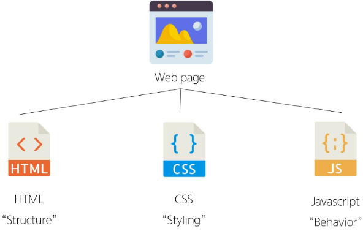
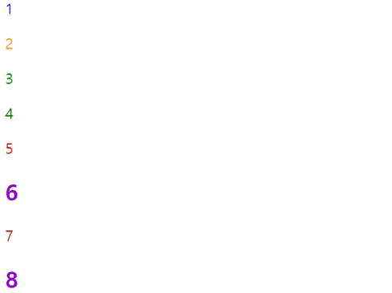
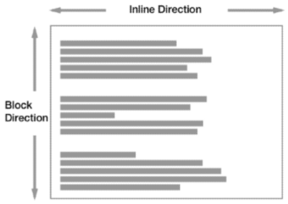
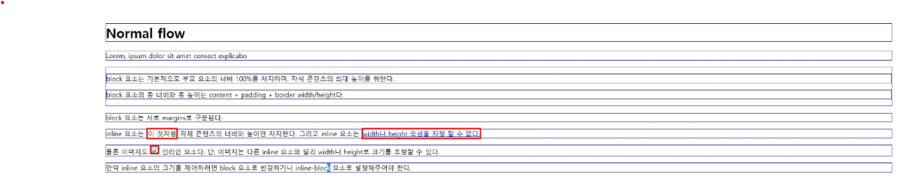

# 웹
### World Wide Web
: 인터넷으로 연결된 컴퓨터들이 정보를 공유하는 거대한 정보 공간
### Web
: Web site, Web application 등을 통해 사용자들이 정보를 검색하고 상호 작용하는 기술
### Web site
: 인터넷에서 여러 개의 **Web page**가 모인 것으로, 사용자들에게 정보나 서비스를 제공하는 공간
### Web page
- HTML, CSS 등의 웹 기술을 이용하여 만들어진, **"Web site"를 구성하는 하나의 요소**


# 웹 구조화
## HTML; HyperText Markup Language
: 웹 페이지의 의미와 **구조**를 정의하는 언어

### Hypertext
: 웹 페이지를 다른 페이지로 연결하는 링크

: 참조를 통해 사용자가 한 문서에서 다른 문서로 즉시 접근할 수 있는 텍스트
- 비선형성 / 상호연결성 / 사용자 주도적 탐색

### Markup Language
: 태그 등을 이용하여 문서나 데이터의 구조를 명시하는 언어
- ex) HTML, Markdown

## Structure of HTML
### HTML 구조
```html
<!DOCTYPE html>
<html lang="en">
<head>
    <meta charest="UTF-8">
    <title>My page</title>
</head>
<body>
    <p>This is my page</p>
</body>
</html>
```
- `<!DOCTYPE html>`: 해당 문서가 html로 문서라는 것을 나타냄
- `<html></html>`: 전체 페이지의 콘텐츠를 포함
- `<title></title>`: 브라우저 탭 및 즐겨찾기 시 표시되는 제목으로 사용
- `<head></head>`: HTML 문서에 관련된 설명, 설정 등 컴퓨터가 식별하는 메타데이터를 작성
    - 사용자에게 보이지 않음
- `<body></body>`: HTML 문서의 내용을 나타냄, 페이지에 표시되는 모든 콘텐츠를 작성
    - 한 문서에 하나의 body 요소만 존재

### HTML Element(요소)
```html
<p>My cat is very grumpy</p>
```
- 하나의 요소는 **여는 태그**와 **닫는 태그** 그리고 그 안의 **내용**으로 구성됨
    - `<p>My cat is very grumpy</p>`: Element
    - `<p>`: Opening tag, `</p>`: Closing tag
    - `My cat is very grumpy`: Content
- 닫는 태그는 태그 이름 옆에 슬래시가 포함됨
    - 닫는 태그가 없는 태그도 존재

### HTML Attributes(속성)
: 사용자가 원하는 기준에 맞도록 요소를 설정하거나 다양한 방식으로 동작을 조절하기 위한 값

`<p class="editor-note">My cat is very grumpy</p>`
- `class="editor-note"`: Attribute
- 나타내고 싶지 않지만 추가적인 기능, 내용을 담고 싶을 때 사용
- CSS에서 스타일 적용을 위해 해당 요소를 선택하기 위한 값으로 활용

### HTML Attributes(속성) 작성 규칙
1. 속성은 요소 이름과 속성 사이에 공백이 있어야 함
2. 하나 이상의 속성들이 있는 경우엔 속성 사이에 공백으로 구분함
3. 속성 값은 열고 닫는 따옴표로 감싸야 함

### HTML 구조 예시
```html
<!DOCTYPE html>
<html lang="en">

<head>
  <meta charset="UTF-8">
  <title>My page</title>
</head>

<body>
  <p>This is my page</p>
  <a href="https://www.google.co.kr/">Google로 이동</a>
  
  
</body>

</html>
```
- vscode에서는 `! + tab`, 여는 태그/닫는 태그 `태그 + tab`
- alt + b -> HTML 페이지 열기
- F12(개발자 도구) -> 주로 Elements, Console 사용

## HTML Text structure
- HTML의 주요 목적 중 하나는 **텍스트 구조와 의미**를 제공하는 것
### HTML
- HyperText Markup Language
- 웹 페이지의 **의미**와 구조를 정의하는 언어
- ex) `<h1>Heading<h1>` - h1 요소는 단순히 텍스트를 크게만 만드는 것이 아닌 현재 **문서의 최상위 제목**이라는 의미를 부여하는 것

### 대표적인 HTML Text Structure
- Heading & Paragraphs
    - `h1, ... , h6`, `p`
- Lists
    - `ol`(ordered list), `ul`(unordered list), `li`
- Emphasis & Importance
    - `em`, `strong`
```html
/* HTML Text structure 예시 */
<body>
    <h1>Main Heading</h1>
    <h2>Sub Heading</h2>
    <p>This is my page</p>
    <p>This is <em>emphasis</em></p>
    <p>Hi <strong>my name</strong> is Air</p>
    <ol>
        <li>파이썬</li>
        <li>알고리즘</li>
        <li>웹</li>
    </ol>
</body>
```

# 웹 스타일링
## CSS; Cascading Style Sheet
- 웹 페이지의 **디자인**과 **레이아웃**을 구성하는 언어

### CSS 구문
```css
h1 {
    color: red;
    font-size: 30px;
}
```
`h1`: 선택자(Selector)
# **----- css 추가 내용 들으세요... 한 45분쯤?**

### CSS 적용 방법
1. 인라인(Inline) 스타일
2. 내부(Internal) 스타일 시트
3. 외부(External) 스타일 시트

#### 인라인(Inline) 스타일
: HTML 요소 안에 style 속성 값으로 작성
```html
...
<body>
    <h1 style="color: blue; background-color: yellow;">Hello World!</h1>
</body>
```

#### 내부(Internal) 스타일 시트
: head 태그 안에 style 태그에 작성
```html
...
<head>
    ...
    <title>Document</title>
    <style>
        h1 {
            color: blue;
            background-color: yellow;
        }
    </style>
</head>
```

#### 외부(External) 스타일 시트
: 별도 CSS 파일 생성 후 HTML link 태그를 사용해 불러오기
```css
/* style.css */
h1 {
    color: blue;
    background-color: yellow;
}
```
```html
...
<head>
    ...
    <link rel="stylesheet" href="style.css">
<title>Document</title>
</head>
...
```

## CSS Selectors (선택자)
: HTML 요소를 선택하여 스타일을 적용할 수 있도록 하는 선택자

### CSS Selectors 종류
- 기본 선택자
    - 전체(*) 선택자
    - 요소(tag) 선택자
    - 클래스(class) 선택자
        - `<p id=-->`
    - 아이디(id) 선택자
    - 속성(attr) 선택자 등
- 결합자 (Combinators)
    - 자손 결합자(" "(space))
    - 자식 결합자(">")

### CSS Selectors 특징
- 전체 선택자(*)
    - HTML 모든 요소를 선택
- 요소 선택자
    - 지정한 모든 태그를 선택
- 클래스 선택자('.'(dot))
    - 주어진 클래스 속성을 가진 모든 요소를 선택
- 아이디 선택자('#')
    - 주어진 아이디 속성을 가진 요소 선택
    - 문서에는 주어진 **아이디를 가진 요소**가 **하나**만 있어야 함
```html
<style>
    /* 전체 선택자 */
    * {
        color: red;
    }

    /* 타입 선택자 */
    h2 {
        color: orange;
    }

    h3,
    h4 {
        color: blue;
    }
    
    /* 클래스 선택자 */
    .green {
        color: green;
    }

    /* 아이디 선택자 */
    #purple {
        color: purple;
    }
</style>
```

### CSS 결합자 특징
- 자손 결합자(" "(space))
    - 첫 번째 요소의 자손 요소들 선택
    - 예) `p span`은 `<p>` 안에 있는 모든 `<span>`을 선택 (하위 레벨 상관 없이)
- 자식 결합자(">")
    - 첫 번째 요소의 직계 자식만 선택
    - 예) `ul > li`은 `<ul>` 안에 있는 모든 `<li>`를 선택 (한 단계 아래 자식들만)
```html
<style>
    ...

    /* 자식 결합자 */
    .green > span {
        font-size: 50px;
    }

    /* 자식 결합자 */
    .green li {
        color: brown;
    }
</style>
```


## Specificity; 명시도
: 결과적으로 요소에 적용할 CSS 선언을 결정하기 위한 알고리즘
- CSS Selector에 가중치를 계산하여 어떤 스타일을 적용할지 결정
- 동일한 요소를 가리키는 2개 이상의 CSS 규칙이 있는 경우 가장 높은 명시도를 가진 Selector가 승리하여 스타일이 적용됨

### CSS; **Cascading** Style Sheet
: 웹 페이지의 디자인과 레이아웃을 구성하는 언어

### Cascade; 계단식
: 한 요소에 동일한 가중치를 가진 선택자가 적용될 때 CSS에서 마지막에 나오는 선언이 사용됨

### 명시도가 높은 순
1. Importance
    - !important
2. Inline 스타일
3. 선택자
    - id 선택자 > class 선택자 > 요소 선택자
4. 소스 코드 선언 순서
5. 상속 받은 속성들

#### 명시도 순서 예시
```html
<p>1</p>
<p class="orange">2</p>
<p class="green orange">3</p>
<p class="orange green">4</p>
<p id="red" class="orange">5</p>
<h2 id="red" class="orange">6</h2>
<p id="red" class="orange" style="color: brown;">7</p>
<h2 id="red" class="orange" style="color: brown;">8</h2>
```
```css
h2 {
    color: darkviolet !important;
}

p {
    color: blue;
}

.orange {
    color: orange;
}

.green {
    color: green;
}

#red {
    color: red;
}
```


#### !important
- 다른 우선순위 규칙보다 우선하여 적용하는 키워드
- **Cascade의 구조를 무시하고 강제로 스타일을 적용하는 방식이므로 사용을 권장하지 않음**

### CSS 상속
- 기본적으로 CSS는 상속을 통해 부모 요소의 속성을 자식에게 상속해 재사용성을 높임

#### CSS 속성 2가지 분류
- 상속 되는 속성
    - Text 관련 요소(font, color, text-align), opacity, visibility 등
- 상속 되지 않는 속성
    - Box model 관련 요소(width, height, border, box-sizing, ...)
    - position 관련 요소(position, top/right/bottom/left, z-index) 등
```html
<ul class="parent">
    <li class="child">Hello</li>
    <li class="child">Bye</li>
</ul>
```
```css
.parent {
    /* 상속 O */
    color: red;

    /* 상속 X */
    border: 1px solid black;
}
```


#### CSS 상속 여부 확인
- MDN의 각 속성별 문서 하단에서 상속 여부를 확인할 수 있음


## CSS Box Model
: 웹 페이지의 모든 HTML 요소를 감싸는 사각형 상자 모델
### 박스 타입
1. Block box
2. Inline box
- 박스 타입에 따라 페이지에서의 배치 흐름 및 다른 박스와 관련하여 박스가 동작하는 방식이 달라짐

### 박스 표시(Display) 타입
**1. Outer display type**

```css
/* Block & Inline */
.index {
    display: block; /* display: inline; */
}
```
- 박스가 문서 흐름에서 어떻게 동작할지를 결정
- 속성 - block, inline

#### block 특징
- 항상 새로운 행으로 나뉨
- width와 height 속성 사용 가능
- padding, margin, border로 인해 다른 요소를 상자로부터 밀어냄
- width 속성을 지정하지 않으면 박스는 inline 방향으로 사용 가능한 공간을 모두 차지함
    - 상위 컨테이너 너비 100%로 채우는 것
- 대표적인 block 타입 태그
    - h1~6, p, div

#### inline 특징
- 새로운 행으로 넘어가지 않음
- width와 height 속성을 사용할 수 없음
- 수직 방향
    - padding, margin, border가 적용되지만 다른 요소를 밀어낼 수는 없음
- 수평 방향
    - padding, margins, borders가 적용되어 다른 요소를 밀어낼 수 있음
- 대표적인 inline 타입 태그
    - a, img, span, strong, em

#### Normal flow
: 일반적인 흐름 또는 레이아웃을 변경하지 않은 경우 웹 페이지 요소가 배치되는 방식




**2. Inner display type**
```css
/* Flexbox */
.container {
    display: flex;
}
```
- 박스 내부의 요소들이 어떻게 배치될지를 결정
- 속성 - flex


----- 강의 다시 보세요...


## 참고

### 명시도 관련 문서
----- MM 참고하세요...

### HTML 스타일 가이드
- 대소문자 구분
    - HTML은 대소문자를 구분하지 않지만, 소문자 사용을 강력히 권장
    - 태그명과 속성명 모두 소문자로 작성
- 속성 따옴표
    - 속성 값에는 큰 따옴표(")를 사용하는 것이 일반적
- 코드 구조와 포맷팅
    - 일관된 들여쓰기를 사용 (보통 2칸 공백)
    - 각 요소는 한 줄에 하나씩 작성
    - 중첩된 요소는 한 단계 더 들여쓰기
- 공백 처리
    - HTML은 연속된 공백을 하나로 처리
    - ----- 마저 쓰세요...

### CSS 스타일 가이드
- 코드 구조와 포맷팅
    - ----- 쓰세요...
    - **마지막 속성 뒤에는 세미콜론(;) 넣기**
- 선택자 사용
    - class 선택자를 우선적으로 사용
    - id, 요소 선택자 등은 가능한 피할 것
    -> 여러 선택자들과 함께 사용할 경우 우선순위 규칙에 따라 예기치 못한 스타일 규칙이 적용되어 -----
- 명명 규칙
    -케밥 케이스

**CSS의 모든 속성은 외우는 것이 아님**

### MDN Web Docs
- HTML, CSS, JavaScript, 웹 API, 개발 도구 등 웹 기술에 대한 정보를 제공