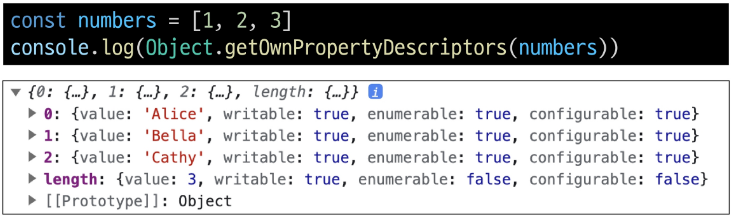
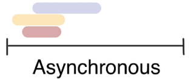
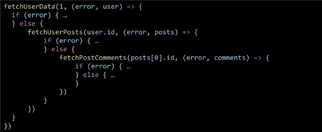

# 객체
### Object
: 키로 구분된 데이터 집합(data collection)을 저장하는 자료형

## 구조 및 속성

### 객체 구조
- 중괄호('{}')를 이용해 작성
- 중괄호 안에는 `key: value` 쌍으로 구성된 속성(property)를 여러 개 작성 가능
- key는 문자형만 허용 - 중복X, 불변형 자료 타입
- value는 모든 자료형 허용
```javascript
const user = {
    name: 'Alice',
    'key with space': true,
    greeting: function () {
    return 'hello'
    }
}
```
- 공백이 있는 경우만 따옴표(`'key with space'`), 아닌 경우 따옴표 없어도 무관(`name`)
- 함수도 객체다 (함수 표현식으로 greeting에 할당)

### 속성 참조
- 점('.', chaining operator) 또는 대괄호('[]')로 객체 요소 접근
- key 이름에 띄어쓰기 같은 구분자가 있으면 대괄호 접근만 가능
```javascript
// 조회
console.log(user.name) // Alice
console.log(user['key with space']) // true

// 추가
user.address = 'korea'
console.log(user) // {name: 'Alice', key with space: true, address: 'korea', greeting: ƒ}

// 수정
user.name = 'Bella'
console.log(user.name) // Bella

// 삭제
delete user.name
console.log(user) // {key with space: true, address: 'korea', greeting: ƒ}
```

### 'in' 연산자
- 속성이 객체에 존재하는지 여부를 확인
```javascript
console.log('greeting' in user) // true
console.log('country' in user) // false
```

## 객체와 함수

### Method
: 객체 속성에 정의된 함수
- `object.method()` 방식으로 호출
- 메서드는 객체를 '행동'할 수 있게 함
```javascript
// 메서드 호출
console.log(user.greeting()) // hello
```
## this

### Method
: 객체 속성에 정의된 함수
- **`this`** 키워드를 사용해 객체에 대한 특정한 작업을 수행할 수 있음

### 'this' keyword
: 함수나 메서드를 호출한 객체를 가리키는 키워드
- 함수 내에서 객체의 속성 및 메서드에 접근하기 위해 사용

### Method & this 사용 예시
```javascript
const person = {
    name: 'Alice',
    greeting: function () {
    return `Hello my name is ${this.name}`
    },
}

console.log(person.greeting()) // Hello my name is Alice
```
- person.greeting -> this - person

### JavaScript에서는 this는 함수를 **"호출하는 방법"**에 따라 가리키는 대상이 다름
| 호출 방법 | 대상 |
| --- | --- |
| 단순 호출 | 전역 객체 |
| 메서드 호출 | 메서드를 호출한 객체 |

### 1. 단순 호출 시 this
- 가리키는 대상 -> 전역 객체
```javascript
    const myFunc = function () {
      return this
    }
    console.log(myFunc()) // window
```
### 2. 가리키는 대상 -> 메서드를 호출한 객체
```javascript
    const myObj = {
      data: 1,
      myFunc: function () {
        return this
      }
    }
    console.log(myObj.myFunc()) // myObj
```
# *----- 이거 강의 한 번만 다시 봐봐*


### 중첩돤 함수에서의 this 문제점과 해결책
```javascript
// 2. 중첩된 함수
// 2.1 일반 함수
const myObj2 = {
    numbers: [1, 2, 3],
    myFunc: function () {
    this.numbers.forEach(function (number) {
        console.log(this) // window
    })
    }
}
console.log(myObj2.myFunc())
// forEach의 인자로 작성된 함수는
// 일반적인 함수 호출이기 때문에
// this가 전역 객체를 가리킴


// 2.2 화살표 함수
const myObj3 = {
    numbers: [1, 2, 3],
    myFunc: function () {
    this.numbers.forEach((number) => {
        console.log(this) // myObj3
    })
    }
}
console.log(myObj3.myFunc())
// 화살표 함수는 자신만의 this를 가지지 않기 때문에
// 외부 함수(myFunc)에서의 this 값을 가져옴
```

### JavaScript `this` 정리
- JavaScript의 함수는 호출될 때 `this`를 암묵적으로 전달 받음
- JavaScript에서 `this`는 함수가 "호출되는 방식"에 따라 결정되는 현재 객체를 나타냄
- Python의 `self`와 Java의 `this`가 선언 시 이미 값이 정해지는 것에 비해 JavaScript의 `this`는 **함수가 호출되기 전까지 값이 할당되지 않고 호출 시에 결정**됨 (동적 할당)
- `this`가 미리 정해지지 않고 호출 방식에 의해 결정되는 것은
    - 장점: 함수(메서드)를 하나만 만들어 여러 객체에 재사용 가능
    - 단점: 이런 유연함이 실수로 이어질 가능성
- 개발자는 `this`의 동작 방식을 충분히 이해하고 장점을 취하면서 실수를 피하는 데 집중

## 추가 객체 문법

### 1. 단축 속성
- 키 이름과 값으로 쓰이는 변수의 이름이 같은 경우 단축 구문 사용 가능
```javascript
const name = 'Alice'
const age = 30

const user = {
    name: name,
    age: age
}
```

```javascript
const name = 'Alice'
const age = 30

const user = {
    name,
    age
}
```
### 2. 단축 메서드
- 메서드 선언 시 `function` 키워드 생략 가능
```javascript
const myObj1 = {
    myFunc: function () {
    return 'Hello'
    }
}

const myObj2 = {
    myFunc() {
    return 'Hello'
    }
}
```


### 3. 계산된 속성 (computed property name)
- 키가 대괄호([])로 둘러싸여 있는 속성
- 고정된 값이 아닌 변수 값을 사용할 수 있음
```javascript
const product = prompt('물건 이름을 입력해주세요')
const prefix = 'my'
const suffix = 'property'

const bag = {
    [product]: 5,
    [prefix + suffix]: 'value'
}

console.log(bag) // {연필: 5, myproperty: 'value'}
```

### 4. 구조 분해 할당 (desturcting)
- 배열 또는 객체를 분해하여 객체 속성을 변수에 쉽게 할당할 수 있는 문법
```javascript
const userInfo = {
    firstName: 'Alice',
    userId: 'alice123',
    email: 'alice123@gmail.com'
}
```
```javascript
// 구조 분해 할당 전
const firstName = userInfo.name
const userId = userInfo.userId
const email = userInfo.email
```
```javascript
// 구조 분해 할당 후
const { firstName } = userInfo
const { firstName, userId } = userInfo
const { firstName, userId, email } = userInfo
```
```javascript
// Alice alice123 alice123@gmail.com
console.log(firstName, userId, email)
```

### 4. 구조 분해 할당 활용
- '함수의 매개변수'로 객체 구조 분해 할당 활용 가능
```javascript
const person = {
    name: 'Bob',
    age: 35,
    city: 'London',
}

function printInfo({ name, age, city }) {
    console.log(`이름: ${name}, 나이: ${age}, 도시: ${city}`)
}

// 함수 호출 시 객체를 구조 분해하여 함수의 매개변수로 전달
printInfo(person) // '이름: Bob, 나이: 35, 도시: London'
```

### 5. Oject with '전개 구문'
- "객체 복사"
    - 객체 내부에서 객체 전개
- 얕은 복사에 활용 가능
```javascript
const obj = { b: 2, c: 3, d: 4 }
const newObj = { a: 1, ...obj, e: 5 }
console.log(newObj) // {a: 1, b: 2, c: 3, d: 4, e: 5}
```

### 6. 유용한 객체 메서드
*(그냥 보고 넘어가시죠)*
- Object.keys()
- Object.values()
```javascript
const profile = {
    name: 'Alice',
    age: 30
}

console.log(Object.keys(profile)) // ['name', 'age']
console.log(Object.values(profile)) // ['Alice', 30]
```


### 7. Optional chaining('?.')
- 속성이 없는 중첩 객체를 에러 없이 접근할 수 있는 방법
- 만약 참조 대상이 null 또는 undefined라면 에러가 발생하는 것 대신 평가를 멈추고 undefined를 반환
```javascript
console.log(user.address.street)    // Uncaught TypeError
console.log(user.address?.street)    // undefined
```
- 만약 Optional chaining을 사용하지 않는다면 다음과 같이 '&&' 연산자를 사용해야 함
```javascript
console.log(user.address && user.address.street)    // undefined
```

### 7. Optional chaining 장점
- 참조가 누락될 가능성이 있는 경우 연결된 속성으로 접근할 대 더 짧고 간단한 표현식을 작성할 수 있음
- 어떤 속성이 필요한지에 대한 보증이 확실하지 않을 때 객체의 내용을 보다 편리하게 탐색할 수 있음


### 7. Optional chaining 주의사항
1. Optional chaining은 존재하지 않아도 괜찮은 대상에만 사용해야 함 (남용 X)
    - 왼쪽 평가대상이 없어도 괜찮은 경우에만 선택적으로 사용
    - 중첩 객체를 에러 없이 접근하는 것이 사용 목적이기 때문

```javascript
// 위 예시 코드 논리상 user는 반드시 있어야 하지만 address는 필수 값이 아님
// user에 값을 할당하지 않은 문제가 있을 때 바로 알아낼 수 있어야 하기 때문

// Bad
user?.address?.street

// Good
user.address?.street
```
2. Optional chaining 앞의 변수는 반드시 선언되어 있어야 함

```javascript
console.log(myObj?.address) //Uncaught ReferenceError: myObj is not defined
```
### 7. Optional chaining 정리
1. `obj?.prop`
- obj가 존재하면 obj.prop, 그렇지 않으면 undefined 반환
2. `obj?.[prop]`
- obj가 존재하면 obj[prop], 그렇지 않으면 undefined 반환
3. `obj?.method()`
- obj가 존재하면 obj.method(), 그렇지 않으면 undefined 반환

```javascript
```

# 참고 ----- 시험에 안 나온다

## JSON
- "JavaScript Object Notation"
- Key-Value 형태로 이루어진 자료 표기법
- JavaScript의 Object와 유사한 구조를 가지고 있지만 JSON은 형식이 있는 **"문자열"**


# 배열

### Object
: 키로 구분된 데이터 집합(data collection)을 저장하는 자료형
- 이제는 **순서가 있는 collection**이 필요

- for...in은 순서 X, for...of는 순서 O 배열로 ㄱㄱ

### Array
: 순서가 있는 데이터 집합을 저장하는 자료 구조

### 배열 구조
- 대괄호('[]')로 작성
- 요소 자료형: 제약 없음
- length 속성을 사용해 배열에 담긴 요소가 몇 개인지 알 수 있음
```javascript
const names = ['Alice', 'Bella', 'Cathy']

console.log(names[0]) // Alice
console.log(names[1]) // Bella
console.log(names[2]) // Cathy

console.log(names.length) // 3
```


## 배열 메서드

### 주요 메서드
| 메서드 | 역할 |
| --- | --- |
push / pop | 배열 끝 요소를 추가 / 제거
unshift / shift | 배열 앞 요소를 추가 / 제거


## Array Helper Method
: 배열 조작을 보다 쉽게 수행할 수 있는 특별한 메서드 모음
- 배열의 각 요소를 **순회**하며 각 요소에 대해 함수(**콜백함수**)를 호출
    - forEach(), map(), filter(), every(), some(), reduce() 등
- 메서드 호출 시 인자로 함수(**콜백함수**)를 받는 것이 특징

### 주요 Array Helper Method
| 메서드 | 역할 |
| ----- | ---- |
forEach | - 배열 내의 모든 요소 각각에 대해 함수(콜백함수)를 호출
|forEach| - 반환 값 없음
map | - 배열 내의 모든 요소 각각에 대해 함수(콜백함수)를 호출
|map| - 함수 호출 결과를모아 새로운 배열을 반환

### forEach()
: 배열의 각 요소를 반복하며 모든 요소에 대해 함수를 호출


### forEach 구조
```javascript
arr.forEach(callback(item[, index[, array]]))
array.forEach(function (item, index, array) {
    // do soemthing
})
```
- 콜백함수는 3가지 매개변수로 구성
    1. `item`: 처리할 배열의 요소
    2. `index`: 처리할 배열 요소의 인덱스 (선택 인자)
    3. `array`: `forEach`를 호출한 배열 (선택 인자)
- 반환 값
    - undefined


### forEach 예시
```javascript
const names = ['Alice', 'Bella', 'Cathy']

// 일반 함수 표기
names.forEach(function (name) {
    console.log(name)
})

// 화살표 함수 표기
names.forEach((name) => {
    console.log(name)
})
```
```javascript
// 출력 결과
Alice
Bella
Cathy
```

### forEach 활용
```javascript
names.forEach(function (name, index, array) {
    console.log(`${name} / ${index} / ${array}`)
})
```
```javascript
// 출력 결과
Alice / 0 / Alice, Bella, Cathy
Bella / 1 / Alice, Bella, Cathy
Cathy / 2 / Alice, Bella, Cathy
```


### map()
: 배열의 모든 요소에 대해 함수를 호출하고, 반환된 호출 결과 값을 모아 **새로운 배열을 반환**

### map 구조
```javascript
arr.map(callback(item[, index[, array]]))
const newArr = array.map(function (item, index, array) {
    // do something
})
```
- forEach의 매개 변수와 동일
- 반환 값
    - 배열의 각 요소에 대해 실행한 "callback의 결과를 모은 새로운 배열"
    - forEach 동작 원리와 같지만 forEach와 달리 새로운 배열을 반환함

### map 예시
```javascript
const persons = [
    { name: 'Alice', age: 20 },
    { name: 'Bella', age: 21 }
]

// 1. for...of
let result1 = []
for (const person of persons) {
    result1.push(person.name)
}
console.log(result1)    // ['Alice', 'Bella']

// 2. map
const result2 = persons.map(function (person) {
    return person.name
})
console.log(result2)    // ['Alice', 'Bella']
```

### map 활용
```javascript
// 화살표 함수 표기
const names = ['Alice', 'Bella', 'Cathy']

const result3 = names.map(function (name) {
    return name.length
})

const result4 = names.map((name) => {
    return name.length
})

console.log(result3) // [5, 5, 5]
console.log(result4) // [5, 5, 5]
```
```javascript
// 커스텀 콜백 함수
const numbers = [1, 2, 3]

const doubleNumber = numbers.map((number) => {
    return number * 2
})

console.log(doubleNumber) // [2, 4, 6]
```

### python에서의 map 함수와 비교
- python의 `map`에 `square` 함수를 인자로 넘겨 `numbers` 배열의 각 요소를 `square` 함수의 인자로 사용하였음
- map 메서드에 `callBackFunc` 함수를 인자로 넘겨 `numbers` 배열의 각 요소를 `callBackFunc` 함수의 인자로 사용하였음

### 배열 순회 종합
- for loop
    - 배열의 인덱스를 이용하여 각 요소에 접근
    - break, continue 사용 가능
- for...of
    - 배열 요소에 바로 접근 가능
    - break, continue 사용 가능
- forEach
    - 간결하고 가독성이 높음
    - callback 함수를 이용하여 각 요소를 조작하기 용이
    - break, continue 사용 불가능


### 기타 Array
*(some every는 있다 정도)*

*(forEach만큼 많이 쓰는 게 filter find)*
| 메서드 | 역할 |
| --- | --- |
| filter | 콜백 함수의 반환 값이 참인 요소들만 모아서 새로운 배열을 반환 |
| find | 콜백 함수의 반환 값이 참이면 해당 요소를 반환 |
| some | 배열의 요소 중 적어도 하나라도 콜백 함수를 통과하면 true를 반환하며 즉시 배열 순회 중지. 반면에 모두 통과하지 못하면 false를 반환 |
| every | 배열의 모든 요소가 콜백 함수를 통과하면 true를 반환. 반면에 하나라도 통과하지 못하면 즉시 false를 반환하고 배열 순회 중지 |


# 참고

## "배열은 객체다"
- 배열도 키와 속성들을 담고 있는 참조 타입의 객체
- 배열의 요소를 대괄호 접근법을 사용해 접근하는 건 객체 문법과 같음
    - 배열의 키는 숫자
- 숫자형 키를 사용함으로써 배열은 객체 기본 기능 이외에도 "순서가 있는 컬렉션"을 제어하게 해주는 특별한 메서드를 제공하는 것
- 배열은 인덱스를 키로 가지며 length 속성을 갖는 특수한 개체


arr[-1] = 4 라고 하면 -1 자리에 4가 아니라 {'-1': 4} 가 추가됨


# 비동기

### Synchronous(동기)
: 프로그램의 실행 흐름이 순차적으로 진행
- 하나의 작업이 완료된 후에 다음 작업이 실행되는 방식

### Synchronous 예시
1. 커피 주문 - 한 손님의 주문을 받고 제작 후 서빙하기 전까지 다음 주문을 못 받음
2. 메인 작업이 모두 수행되어야 마지막 작업이 수행됨
3. 함수의 작업이 완료될 때까지 기다렸다가 값을 반환해야 계속 진행 가능

### Asynchronous(비동기)
: 프로그램의 실행 흐름이 순차적이지 않으며, 작업이 완료되기를 기다리지 않고 다음 작업이 실행되는 방식
- 작업의 완료 여부를 신경 쓰지 않고 **동시에 다른 작업들을 수행할 수 있음**

### Asynchronous 예시
1. 커피 주문 - 한 손님의 주문을 받고 제작하는 동안 다음 주문을 받을 수 있음
2. Gmail에서 메일 전송을 누르면 목록 화면으로 전환되지만 실제로 메일을 보내는 작업은 병렬적으로 별도로 처리됨
3. 브라우저는 웹페이지를 먼저 처리되는 요소부터 그려 나가며 처리가 오래 걸리는 것들은 별도로 처리가 완료되는 대로 병렬적으로 진행
```javascript
console.log('a')

setTimeout(() => {
    console.log('b')
}, 3000)

console.log('c')

// 출력 결과
// a
// c
// b
```

### Asynchronous 특징
- 병렬적 수행
- 당장 처리를 완료할 수 없고 시간이 필요한 작업들은 별도로 요청을 보낸 뒤 응답이 빨리 오는 작업부터 처리


## JavaScript와 비동기

### Single Thread 언어, JavaScript

#### Thread란?
: 작업을 처리할 때 실제로 작업을 수행하는 주체로, multi-thread라면 업무를 수행할 수 있는 주체가 여러 개라는 의미

### JavaScript는 한 번에 여러 일을 수행할 수 없다/
- 한 번에 하나의 일ㅇ만 수행하는 Single Thread 언어로, 동시에 여러 작업 처리 불가
- 하나의 작업을 요청한 순서대로 처리할 수밖에 없음
- 어떻게 Single Thread인 JavaScript가 비동기 처리를 할 수 있을까?

### JavaScript Runtime
- "JavaScript가 동작할 수 있는 환경(Runtime)"
- 비동기 처리를 할 수 있도록 도와주는 환경 필요
- 비동기 관련 작업은 "브라우저" 또는 "Node"와 같은 환경에서 처리

### 브라우저 환경에서의 JavaScript 비동기 처리 관련 요소
1. JavaScript Engine의 **Call Stack**
2. **Web API**
3. **Task Queue**
4. **Event Loop**

### 런타임의 시각적 표현
- call stack - last in first out
- task queue - first in first out
- 이해 안 되면 교재 p.94

### 브라우저 환경에서의 JavaScript 비동기 처리 동작 방식
1. 모든 작업은 Call Stack (LIFO)으로 들어간 후 처리된다.
2. 오래 걸리는 작업이 Call Stack으로 들어오면 Web API로 보내 별도로 처리하도록 한다.
3. Web API에서 처리가 끝난 작업들은 곧바로 Call Stack으로 들어가지 못하고 Task Queue(FIFO)에 순서대로 들어간다.
4. Event Loop가 Call Stack이 비어 있는 것을 계속 체크하고 Call Stack이 빈다면 Task Queue에서 가장 오래된(가장 먼저 처리되어 들어온) 작업을 Call Stack으로 보낸다.

### 비동기 처리 동작 요소
1. Call Stack
    - 요청이 들어올 때마다 순차적으로 처리하는 Stack(LIFO)
    - 기본적인 JavaScript의 Single Thread 작업 처리
2. Web API
    -JavaScript 엔진이 아닌 브라우저에서 제공하는 runtime 환경
    - 시간이 소요되는 작업을 처리 (setTimeout, DOM Event, 비동기 요청 등)
3. Task Queue (Callback Queue)
    - 비동기 처리된 Callback 함수가 대기하는 Queue(FIFO)
4. Event Loop
    - 태스크(작업)가 들어오길 기다렸다가 태스크가 들어오면 이를 처리하고, 처리할 태스크가 없는 경우엔 잠드는, 끊임없이 돌아가는 자바스크립트 내 루프
    - Call Stack과 Task Queue를 지속적으로 모니터링
    - Call Stack이 비어 있는지 확인 후 비어 있다면 Task Queue에서 대기 중인 오래된 작업을 Call Stack으로 Push

### 정리
- JavaScript는 한 번에 하나의 작업을 수행하는 Single Thread 언어로 동기적 처리를 진행
- 하지만 브라우저 환경에서는 Web API에서 처리된 작업이 지속적으로 Task Queue를 거쳐 Event Loop에 의해 Call Stack에 들어와 순차적으로 실행됨으로써 비동기 작업이 가능한 환경이 됨

# AJAX
: Asynchronous JavaScript and ~~XML~~ JSON
: XMLHttpRequest 기술을 사용해 복잡하고 동적인 웹 페이지를 구성하는 프로그래밍 방식

### AJAX 정의
- 비동기적인 웹 애플리케이션 개발 위한 기술
- 브라우저와 서버 간 데이터를 비동기적으로 교환하는 기술
- AJAX를 사용하면 페이지 전체를 새로고침하지 않고도 동적으로 데이터를 불러와 화면을 갱신할 수 있음
- AJAX의 'x'는 XML이라는 데이터 타입을 의미하긴 하지만, 요즘은 더 가벼운 용량과 JavaScript의 일부라는 장점 때문에 'JSON'을 많이 사용

### AJAX 목적
- 전체 페이지가 다시 로드되지 않고 HTML 페이지 일부 DOM만 업데이트
- 웹 페이지 일부가 다시 로드되는 동안에도 코드가 계속 실행되어, 비동기식으로 작업할 수 있음

## XHR; XMLHttpRequest 객체
: 서버와 상호작용할 때 사용하는 객체

### XMLHttpRequest 특징
- 브라우저와 서버 간의 네트워크 요청을 전송할 수 있음
- 사용자의 작업을 방해하지 않고 페이지의 일부를 업데이트할 수 있음
- 요청의 상태와 응답을 모니터링할 수 있음
- 이름에 XML이라는 데이터 타입이 들어가긴 하지만 XML 뿐만 아니라 모든 종류의 데이터를 가져올 수 있음

### XHR 구조
- HTTP 요청을 생성하고 전송하는 기능을 제공
- AJAX 요청을 통해 서버에서 데이터를 가져와 웹 페이지에 동적으로 표시

### 기존 기술과의 차이 - 기존 방식
1. 클라이언트(브라우저)에서 form을 채우고 이를 서버로 제출(submit)
2. 서버는 요청 내용에 따라 데이터 처리 후 새로운 웹페이지를 작성하여 응답으로 전달
- 결과적으로 모든 요청에 따라 새로운 페이지를 응답 받기 때문에 계속해서 새로고침이 발생
- 기존 페이지와 유사한 내용을 가지고 있는 경우 중복된 코드를 다시 전송 받음으로써 대역폭을 낭비하게 되는 경우가 많음

### 기존 기술과의 차이 - AJAX
1. XHR 객체 생성 및 요청
2. 서버는 새로운 페이지를 응답으로 만들지 않고 필요한 부분에 대한 데이터만 처리 후 응답(JSON 및 기타 데이터)
- 새로운 페이지를 받는 것이 아닌 필요한 부분의 데이터만 받아 기존 페이지의 일부를 수정 (새로고침 X)
- 서버에서 모두 처리되던 데이터 처리의 일부분이 이제는 클라이언트 쪽에서 처리되므로 교환되는 데이터 양과 처리 양이 줄어듦

### 이벤트 핸들러는 비동기 프로그래밍의 한 형태
- 이벤트가 발생할 때마다 호출되는 함수(콜백 함수)를 제공하는 것
- HTTP 요청은 응답이 올 때까지 시간이 걸릴 수 있는 작업이라 비동기며, 이벤트 핸들러를 XHR 객체에 연결해 요청의 진행 상태 및 최종 완료에 대한 응답을 받음

# Callback과 Promise

## 비동기 콜백

### 비동기 처리의 단점
- 비동기 처리의 핵심은 Web API로 들어오는 순서가 아니라 **작업이 완료되는 순서에 따라 처리**한다는 것
- 그런데 이는 개발자 입장에서 **코드의 실행 순서가 불명확**하다는 단점 존재
- 이와 같은 단점은 실행 결과를 예상하면서 코드를 작성할 수 없게 함

- 콜백 함수를 사용하자!

### 비동기 콜백
- 비동기적으로 처리되는 작업이 완료되었을 때 실행되는 함수
- 연쇄적으로 발생하는 비동기 작업을 **순차적으로 동작**할 수 있게 함
- ------

### 비동기 콜백의 한계
- 비동기 콜백 함수는 보통 어떤 기능의 실행 결과를 받아서 다른 기능을 수행하기 위해 많이 사용됨
- 이 과정을 작성하다 보면 비슷한 패턴이 계속 발생
    - A를 처리해서 결과가 나오면, 첫 번째 callback 함수를 실행하고 첫 번째 callback 함수가 종료되면, 두 번째 callback 함수를 실행하고 두 번째 callback 함수가 종료되면, 세 번째 callback 함수를 실행하고 ...

- "콜백 지옥" 발생


### 콜백 지옥 (Callback Hell)
- 비동기 처리를 위한 콜백을 작성할 때 마주하는 문제


### 콜백 함수 정리
- 콜백 함수는 비동기 작업을 순차적으로 실행할 수 있게 하는 반드시 필요한 로직
- 비동기 코드를 작성하다 보면 콜백 함수로 인한 콜백 지옥은 빈번히 나타나는 문제며 이는 코드의 가독성을 해치고 유지 보수가 어려워짐
- 지옥에 빠지지 않는 다른 표기 형태가 필요

## 프로미스
: JavaScript에서 비동기 작업의 결과를 나타내는 객체
- 비동기 작업이 완료되었을 때 결과 값을 반환하거나, 실패 시 에러를 처리할 수 있는 기능을 제공

### "Promise" object
- 자바스크립트에서 비동기 작업을 처리하기 위한 객체
- 비동기 작업의 성공 또는 실패와 관련된 결과나 값을 나타냄
- 콜백 지옥 문제를 해결하기 위해 등장한 비동기 처리를 위한 객체
- "작업이 끝나면 실행시켜 줄게"라는 약속
    - 성공에 대한 약속 `then()`
    - 실패에 대한 약속 `catch()`
```javascript
const fetchData = () => {
    return new Promise((resolve, reject) => {
        const xhr = new XMLHttpRequest()
        xhr.open('GET', 'https://api.thecatapi.com/v1/images/search')
        xhr.send()
    })
}
const promiseObj = fetchData()
console.log(promiseObj) // Promise object
```

### 비동기 콜백 vs Promise
```javascript
// 비동기 콜백 방식
work1(function () {
    // 첫 번째 작업 ...
    work2(result1, function (result2) {
        // 두 번째 작업 ...
        work3(result2, function (result3) {
            console.log('최종 결과 :' + result3)
        })
    })
})
```
```javascript
// promise 방식
work1()
    .then((result1) => {
        // work2
        return result2
    })
    .then((result2) => {
        // work3
        return result3
    })
    .catch((error) => {
        // error handling
    })
```

### then 메서드 chaining의 목적
- 비동기 작업의 **"순차적인"** 처리 가능
- 코드를 보다 직관적이고 가독성 좋게 작성할 수 있도록 도움

### then 메서드 chaining의 장점
1. 가독성
    - 비동기 작업 순서와 의존 관계 명확히 표현, 가독성 ↑
2. 에러 처리
    - 각 비동기 작업 단계 에러 분할에서 처리 가능
3. 유연성
    - 각 단계마다 필요한 데이터 가공 또는 다른 비동기 작업 수행 가능, 더 복잡한 비동기 흐름 구성 가능
4. 코드 관리
    - 비동기 작업 분리하여 구성하면 관리 용이

### Promise가 보장하는 것 (vs 비동기 콜백)
1. 콜백 함수는 JavaScript의 Event Loop가 현재 실행 중인 Call Stack을 완료하기 이전에는 절대 호출되지 않음
    - 반면 Promise callback 함수는 Event Queue에 배치되는 엄격한 순서로 호출됨
2. 비동기 작업이 성공하거나 실패한 뒤에 `then` 메서드를 이용하여 추가한 경우에도 **호출 순서를 보장**하며 동작
3. `then`을 여러 번 사용하여 여러 개의 callback 함수를 추가할 수 있음
    - 각각의 callback은 주어진 순서대로 하나하나 실행하게 됨
    - Chaining은 Promise의 가장 뛰어난 장점

# Axios
: JavaScript에서 사용되는 HTTP 클라이언트 라이브러리

### Axios 정의
: 클라이언트 및 서버 사이에 HTTP 요청을 만들고 응답을 처리하는 데 사용되는 자바스크립트 라이브러리
- 서버와의 HTTP 요청과 응답을 간편하게 처리할 수 있또록 도와주는 도구
- 브라우저를 위한 XHR 객체 생성
- 간편한 API를 제공하며, Promise 기반의 비동기 요청을 처리
- 주로 웹 애플리케이션에서 서버와 통신할 때 사용

### AJAX를 활용한 클라이언트 서버 간 동작
XHR 객체 생성 및 요청
-> 응답 데이터 생성
-> JSON 데이터 응답
-> Promise 객체 데이터를 활용해 DOM 조작
(웹 페이지의 일부분만을 다시 로딩)

### Axios 사용
- CDN 방식으로 사용
- https://axios-http.com/
```html
<script src="https://cdn.jsdelivr.net/npm/axios/dist/axios.min.js"><script>
```

### Axios 구조
- `axios` 객체를 활용해 요청을 보낸 후 응답 데이터를 `promise` 객체를 받음
- `promise` 객체는 `then`과 `catch` 메서드를 활용해 각각 필요한 로직을 수행
```javascript
const promiseObj = axios({
    method: 'get',
    url: 'https://api.thecatapi.com/v1/images/search'
})

console.log(promiseObj) // Promise object

promiseObj.then((response) => {
    console.log(response) // Response object
    console.log(response.data)  // Response data
})
```
```javascript
axios({
    method: 'get',
    url: 'https://api.thecatapi.com/v1/images/search'
})
    .then((response) => {
    console.log(response)
    console.log(response.data)
    })
```
- `then` 메서드를 사용해서 "성공하면 수행할 로직"을 작성
- `catch` 메서드를 사용해서 "실패하면 수행할 로직"을 작성
```javascript
axios({
    method: 'post',
    url: '/user/12345',
    data: {
        firstName: 'Fred',
        lastName: 'Flintstone'
    }
})
    .then(요청에 성공하면 수행할 콜백함수)
    .catch(요청에 실패하면 수행할 콜백함수)
```

### then & catch의 chaining
- `axios`로 처리한 비동기 로직은 항상 `promise` 객체를 반환
- 즉, `then`과 `catch`는 모두 항상 `promise` 객체를 반환
    - 계속해서 **`chaining`**을 할 수 있음
- `then`을 계속 이어 나가면서 작성할 수 있게 됨
```javascript
axios({})   // Promise 객체 return
    .then(성공하면 수행할 1번 콜백함수)
    .then(1번 콜백함수가 성공하면 수행할 2번 콜백함수)
    .then(2번 콜백함수가 성공하면 수행할 3번 콜백함수)
    ...
    .catch(실패하면 수행할 콜백함수)
```

### then & catch
- `then(callback)`
    - 요청한 작업이 성공하면 callback 실행
    - callback은 이전 작업의 성공 결과를 인자로 전달 받음
- `catch(callback)`
    - `then()`이 하나라도 실패하면 callback 실행 (남은 then은 중단)
    - callback은 이전 작업의 실패 객체를 인자로 전달 받음

### 고양이 사진 가져오기 실습


### 정리
- `AJAX`
    - 하나의 특정한 기술을 의미하는 것이 아니며, 비동기적인 웹 애플리케이션 개발에 사용하는 기술들을 묶어서 지칭

- `Axios`
    - 클라이언트 및 서버 사이에 HTTP 요청을 만들고 응답을 처리하는 데 사용되는 자바스크립트 라이브러리 (Promise API 지원)

- 프론트엔드에서 `Axios`를 활용해 DRF로 만든 API 서버로 요청을 보내서 데이터를 받아온 후 처리하는 로직을 작성하게 됨

# 참고
### 비동기를 사용하는 이유 - "사용자 경험"
- 예를 들어 아주 큰 데이터 불러온 뒤 실행되는 앱이 있을 때, 동기식으로 처리한다면 데이터를 모두 불러온 후에야 앱의 실행 로직이 수행 -> 사용자들은 마치 앱이 멈춘 것과 같은 경험을 겪음
- 즉, 동기식 처리는 특정 로직이 실행되는 동안 다른 로직 실행을 차단, 마치 프로그램이 응답하지 않는 듯한 사용자 경험 만듦
- 비동기로 처리한다면 먼저 처리되는 부분부터 보여줌, 사용자 경험에 긍정적인 효과 볼 수 있음
- 이와 같은 이유로 많은 웹 기능은 비동기 로직 사용해서 구현