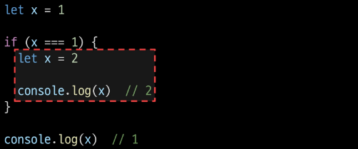
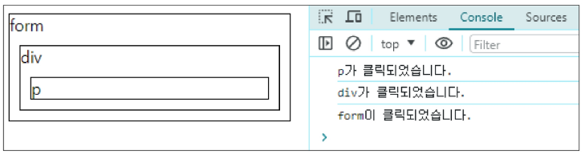
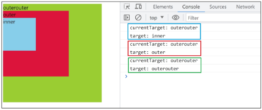

# DOM & Event

# History of JavaScript

## ECMAScript
: Ecma International이 정의하고 있는 표준화된 스크립트 프로그래밍 언어 명세
- 스크립트 언어가 준수해야 하는 규칙, 세부사항 등

### ECMAScript와 JavaScript
- ECMAScript는 JavaScript의 표준, Java는 ECMA 표준을 따르는 구체적인 프로그래밍 언어
- ECMA는 언어의 핵심을 정의하고, Java는 ECMA 표준을 따라 구현된 언어로 사용

### ECMAScript의 역사
- ECMAScript 2015(ES6)에서 객체지향 프로그래밍 언어로써 많은 발전을 이루어, 역사상 가장 중요한 버전으로 평가(2015)

# 변수데이터 타입

## 변수 선언 키워드

### 식별자(변수명) 작성 규칙
- 반드시 문자, 달러('$') 또는 밑줄('_')로 시작
- 대소문자 구분
- 예약어 사용 불가
    - for, if, function 등

### 식별자(변수명) Naming case
*(언급 안 함)*
- 카멜 케이스(camelCase)
    - 변수, 객체, 함수에 사용
- 파스칼 케이스(PascalCase)
    - 클래스, 생성자에 사용
- 대문자 스네이크 케이스(SNAKE_CASE)
    - 상수(constants)에 사용

### 변수 선언 키워드 3가지
1. let
2. const
3. ~~var~~

#### let
- **블록 스코프**(block scope)를 갖는 지역 변수를 선언
- 재할당 가능
- 재선언 불가능
- ES6에서 추가
```javascript
let number = 10 // 1. 선언 및 초기값 할당
number = 20     // 2. 재할당
```
```javascript
let number = 10 // 1. 선언 및 초기값 할당
let number = 20 // 2. 재선언 불가능
```
# *----- 재할당과 재선언의 차이가 무엇인가요...*

#### const
- **블록 스코프**를 갖는 지역 변수를 선언
- 재할당 불가능
- 재선언 불가능
- ES6에서 추가
```javascript
const number = 10   // 1. 선언 및 초기값 할당
number = 10         // 2. 재할당 불가능
```
```javascript
const number = 10   // 1. 선언 및 초기값 할당
const number = 20   // 2. 재선언 불가능
```
```javascript
const number    // const' declarations must be initialized.
```
- **선언 시 반드시 초기값 설정 필요**

#### 블록 스코프 (block scope)
- if, for, 함수 등의 '중괄호({}) 내부'를 가리킴
- 블록 스코프를 가지는 변수는 블록 바깥에서 접근 불가능


#### 어떤 변수 선언 키워드를 사용해야 할까?
- 기본적으로 `const` 사용 권장
- 재할당이 필요하면 그때 `let`으로 변경해서 사용

## 데이터 타입

### 원시 자료형(Primitive type)
: 변수에 값이 직접 저장되는 자료형(불변, 값이 복사)
- Number, String, Boolean, null, undefined
```javascript
const bar = 'bar'
console.log(bar)    // bar

bar.toUpperCase()
console.log(bar)    // bar
```
```javascript
let a = 10
let b = a
b = 20
console.log(a)      // 10
console.log(b)      // 20
```
- 변수에 할당될 때 값이 복사됨
- 변수 간에 서로 영향을 미치지 않음

#### Number
- 정수 또는 실수형 숫자를 표현하는 자료형
- `NaN`(Not a Number): 연산할 수 없는 연산을 진행했을 때

#### String
- 텍스트 데이터
- '+' 연산자를 사용해 문자열끼리 결합
- 뺄셈, 곱셈, 나눗셈 불가능

#### Template literals (템플릿 리터럴)
- 내장된 표현식을 허용하는 문자열 작성 방식
- Backtick(``)을 이용하며, 여러 줄에 걸쳐 문자열을 정의할 수도 있고 JavaScript의 변수를 문자열 안에 바로 연결할 수 있음
- 표현식은 `$`와 중괄호`${expression}`로 표기
```javascript
const age = 100
const message = `홍길동은 ${age}세입니다.`
console.log(message)    // 홍길동은 100세입니다.
```

#### null과 undefined
- null: 변수의 값이 없음을 의도적으로 표현할 때 사용
```javascript
let a = null
console.log(a)  // null
```
- undefined: 변수 선언 이후 직접 값을 할당하지 않으면 자동으로 할당됨
```javascript
let b
console.log(b)  // undefined
```

#### '값이 없음'에 대한 표현이 null과 undefined 2가지인 이유
- **JavaScript의 설계 실수**
- `null`이 원시 자료형임에도 불구하고 `object`로 출력되는 이유는 JavaScript 설계 당시의 버그를 해결하지 않은 것
- 해결하지 못한 이유는 이미 `null` 타입에 의존성을 띄고 있는 수많은 프로그램들이 망가질 수 있기 때문 (하위 호환 유지)
```javascript
typeof null         // "object"
typeof undefined    // "undefined"
```

#### Boolean; True/False
- 조건문 또는 반복문에서 Boolean이 아닌 데이터 타입은 "자동 형변환 규칙"에 따라 `true` 또는 `false`로 변환됨

#### 자동 형변환
| 데이터 타입 | false         | ture             |
|-------------|---------------|------------------|
| undefined   | 항상 false    | X                |
| null        | 항상 false    | X                |
| Number      | 0, -0, NaN    | 나머지 모든 경우 |
| String      | ''(빈 문자열) | 나머지 모든 경우 |

### 참조 자료형(Reference type)
: 객체의 주소가 저장되는 자료형(가변, 주소가 복사)
- Objects(Object, Array, Function)
```javascript
const obj1 = { name: 'Alice', age: 30 }
const obj2 = obj1
obj2.age = 40

console.log(obj1.age)   // 40
console.log(obj2.age)   // 40
```
- 객체를 생성하면 객체의 메모리 주소를 변수에 할당
- 변수 간에 서로 영향을 미침
# *p.27 const는 재할당 불가능이지 않았나요...*


# 연산자

### 할당 연산자
- +=, -=, *=, %=(나머지 반환)

### 증가 & 감소 연산자
*(있다 정도)*
- 증가 연산자 ('++')
    - 피연산자 증가(1을 더함)시키고 연산자 위치에 따라 증가하기 전이나 후의 값 반환

- 감소 연산자 ('--')
    - 피연산자 감소(1을 뺌)시키고 연산자의 위치에 따라 감소하기 전이나 후의 값을 반환

- '+=' 또는 '-='와 같이 더 명시적인 표현 작성 권장

### 비교 연산자
*(python이랑 똑같다)*
- 피연산자들(숫자, 문자, Boolean 등)을 비교하고 결과 값을 boolean으로 반환하는 연산자

### 동등 연산자(==)
- 암묵적 타입 변환까지 진행된다
```javascript
console.log('1' == 1)       // true
```

### 일치 연산자(===)
- 특수 경우 제외하고는 동등 연산자 아닌 **일치 연산자 사용 권장**
```javascript
console.log('1' === 1)      // false
```

### 논리 연산자
- and 연산 `&&`
- or 연산 `||`
- not 연산 `!`
- 단축 평가 지원

# 제어문
## 조건문

### if
```javascript
const name= 'customer'

if (name === 'admin') {
    console.log('관리자님 환영해요')
} else if (name === 'customer') {
    console.log('고객님 환영해요')
} else {
    console.log('반갑습니다. ${name}님')
}
```

### 삼항 연산자 (시험에 안 나옴 기억해두면 좋음)
```javascript
condition ? expression1 : expression2
```
- 이거 맞아 ? 응 : 아니


## 반복문
- while
- for
- for...in
- for...of

### while
*(파이썬이랑 똑같)*
```javascript
let i = 0

while (i < 6) {
    console.log(i)
    i += 1
}
```

### for
- 특정한 조건이 거짓으로 판별될 때까지 반복
```javascript
for (let i = 0; i < 6; i++) {
    console.log(i)
}
```

### for...in
- 객체의 열거 가능한 속성(property)에 대해 반복
    - 속성(property)은 값이 아니라 key
    - array(= ['a', 'b', 'c'])를 순회한다면 0, 1, 2가 출력
        - array -> {0: 'a', 1: 'b', 2: 'c'}로 할당
    - 하지만 순서가 없기 때문에 인덱스순으로 순회하는 것처럼 보여도 그렇지 않음
- object 순회할 때만 쓸 거
```javascript
const object = { a: 'apple', b: 'banana' }

for (const property in object) {
    console.log(property)   // a, b
    console.log(object[property])   // apple, banana
}
```

### for...of
- 반복 가능한 객체(배열, 문자열 등)에 대해 반복
```javascript
const numbers = [0, 1, 2, 3]

for (const number of numbers) {
    console.log(number) // 0, 1, 2, 3
}
```
- 배열의 요소가 직접 할당

### 배열 반복과 for...in
*(수업 시간 언급은 없었음)*
- 객체 관점에서 배열의 인덱스는 정수 이름을 가진 열거 가능한 속성
- for...in은 정수가 아닌 이름과 속성을 포함하여 열거 가능한 모든 속성을 반환
- 내부적으로 for...in은 배열의 반복자가 아닌 속성 열거를 사용하기 때문에 특정 순서에 따라 인덱스를 반환하는 것을 보장할 수 없음
- for...in은 인덱스의 순서가 중요한 **배열에서는 사용하지 않음**
- 배열에서는 **for문, for...of를 사용**
- 객체 관점에서 배열의 인덱스는 정수 이름을 가진 속성이기 때문에 인덱스가 출력됨 (순서 보장 X)

### 반복문 사용 시 const 사용 여부
*(수업 시간 언급은 없었음)*
- for 문
    - `for (let i = 0; i < arr.length; i++) {...}`
    - 최초 정의한 i를 "재할당"하면서 사용하기 때문에 **const를 사용하면 에러 발생**

- for...in, for...of
    - 재할당이 아니라, 매 반복마다 다른 속성 이름이 변수에 저장되는 것이므로 **const 사용해도 에러 발생 X**
    - 단, const 특징에 따라 블록 내부에서 변수 수정할 수 없음

### 반복문 종합
| 키워드 | 특징 | 스코프 | 
| --- | --- | --- |
| while | . |블록 스코프 |
| for | . |블록 스코프 |
| for...in | object 순회 |블록 스코프 |
| for...of | iterable 순회 | 블록 스코프 |


# DOM

### 웹 브라우저에서의 JavaScript
: 웹 페이지의 동적인 기능을 구현

### JavaScript 실행 환경 종류
1. HTML script 태그
2. js 확장자 파일
3. 브라우저 Console

## DOM; The Document Object Model
: 웹 페이지(Document)를 구조화된 객체로 제공하여 프로그래밍 언어가 페이지 구조에 접근할 수 있는 방법을 제공
- 문서 구조, 스타일, 내용 등을 변경할 수 있도록 함

### DOM API
- 다른 프로그래밍 언어가 웹 페이지에 접근 및 조작할 수 있도록 페이지 요소들을 객체 형태로 제공하며 이에 따른 메서드 또한 제공

### DOM 특징
- DOM에서 모든 요소, 속성, 텍스트는 하나의 객체
- 모두 document 객체의 하위 객체로 구성됨

### DOM tree
- 브라우저는 HTML 문서를 해석하여 DOM tree라는 객체 트리로 구조화
- 객체 간 상속 구조가 존재

### 브라우저가 웹 페이지를 불러오는 과정
- 웹 페이지는 웹 브라우저를 통해 해석되어 웹 브라우저 화면에 나타남

### DOM 핵심
: 문서의 요소들을 객체로 제공하여 다른 프로그래밍 언어에서 접근하고 조작할 수 있는 방법을 제공하는 API

## document 객체
: 웹 페이지 객체
: DOM Tree의 진입점
- 페이지를 구성하는 모든 객체 요소를 포함

# DOM 선택

### DOM 조작 시 기억해야 할 것
**웹 페이지를 동적으로 만들기 == 웹 페이지를 조작하기**

조작 순서
1. 조작하고자 하는 요소를 **선택** (또는 탐색)
2. 선택된 요소의 콘텐츠 또는 속성을 **조작**

## 선택 메서드
- `document.querySelector()`
    - 요소 한 개 선택
- `document.querySelectorAll()`
    - 요소 여러 개 선택

### `document.querySelector(selector)`
: 제공한 선택자와 일치하는 element 한 개 선택
- 제공한 CSS selector를 만족하는 첫 번째 element 객체를 반환 (없다면 null 반환)

### `document.querySelectorAll(selector)`
: 제공한 선택자와 일치하는 여러 element를 선택
- 제공한 CSS selector를 만족하는 NodeList를 반환

### DOM 선택 실습


# DOM 조작
1. 속성(attribute) 조작
    - 클래스 속성 조작
    - 일반 속성 조작
2. HTML 콘텐츠 조작
3. DOM 요소 조작
4. 스타일 조작

## 속성 조작

### 클래스 속성 조작
`classList` property

: 요소의 클래스 목록을 DOMTokenList(유사 배열) 형태로 변환

### 1. classList method
- `element.classList.add()`: 지정한 클래스 값을 추가
- `element.classList.remove()`: 지정한 클래스 값을 제거
- `element.classList.toggle()`: 클래스가 존재한다면 제거하고 false를 반환(존재하지 않으면 클래스를 추가하고 true를 반환)

### 클래스 속성 조작 실습

### 2. 일반 속성 조작 메서드
- `element.getAttribute()`: 해당 요소에 지정된 값을 반환(조회)
- `element.setAttribute(name, value)`: 지정된 요소의 속성 값을 설정, 속성이 이미 있으면 기존 값을 갱신(그렇지 않으면 지정된 이름과 값으로 새 속성이 추가)
- `element.removeAttribute()`: 요소에서 지정된 이름을 가진 속성 제거

### 일반 속성 조작 실습


## HTML 콘텐츠 조작
`textContent` property

: 요소의 텍스트 콘텐츠를 표현

### HTML 콘텐츠 조작 실습
```javascript
const h1Tag = document.querySelector('.heading')
console.log(h1Tag.textContent)

h1Tag.textContent = '내용 수정'
console.log(h1Tag.textContent)
```

## DOM 요소 조작

### DOM 요소 조작 메서드
- `document.createElement(tageName)`
    - 작성한 tagName의 HTML 요소를 생성하여 반환
- `Node.appendChild()`
    - 한 Node를 특정 부모 Node의 자식 NodeList 중 마지막 자식으로 삽입
    - 추가된 Node 객체를 반환
- `Node.removeChild()`
    - DOM에서 자식 Node를 제거
    - 제거된 Node 반환

## style 조작
`style` property

: 해당 요소의 모든 style 속성 목록을 포함하는 속성

### style 조작 실습
*(왜 안 쓸까? 스타일 조작 어케 해야할까? 고민해보삼)*

# 참고
*(한 번쯤 읽어보시면 좋을 거 가태요)*
### Node
- DOM의 기본 구성 단위
- DOM 트리의 각 부분은 Node라는 객체로 표현됨
    - Document Node ->  HTML 문서 전체를 나타내는 노드
    - Element Node -> HTML 요소를 나타내는 노드 (예를 들어 \<p>)
    - Text Node -> HTML 텍스트 (Element Node 내의 텍스트 컨텐츠를 나타냄)
    - Attribute Node -> HTML 요소의 속성을 나타내는 노드
### NodeList
- DOM 메서드를 사용해 선택한 Node의 목록
- 배열과 유사한 구조를 가짐
- Index로만 각 항목에 접근 가능
- JavaScript의 배열 메서드 사용 가능
- `querySelectorAll()`에 의해 반환되는 NodeList는 DOM의 변경사항을 실시간으로 반영하지 않음
    - DOM이 나중에 변경되더라도 이전에 이미 선택한 NodeList 값은 변하지 않음
### Element
- Node의 하위 유형
- Element는 DOM 트리에서 HTML 요소를 나타내는 특별한 유형의 Node
- 예를 들어, \<p>, \<div>, \<span>, \<body> 등의 HTML 태그들이 Element 노드를 생성
- Node의 속성과 메서드를 모두 가지고 있으며 추가적으로 요소 특화된 기능(예: className, innerHTML, id 등)을 가지고 있음
- 모든 Element는 Node지만, 모든 Node가 Element인 것은 아님

### DOM 속성 확인 Tip
- 개발자도구 - Elements - Properties
- 해당 요소의 모든 DOM 속성 확인 가능

### Parsing
: 구문 분석, 해석
- 브라우저가 문자열을 해석하여 DOM Tree로 만드는 과정


# 함수
Function: 참조 자료형에 속하며 모든 함수는 `Function` object

## 함수 정의

### 함수 구조
```javascript
function name ([param[, param, [..., param]]]) {
    statements
    return value
}
```
- `function` 키워드
- 함수의 이름
- 함수의 매개변수
- 함수의 body를 구성하는 statments
- **return 값이 없으면 undefined 반환**

### 함수 정의 2가지 방법

선언식 vs 표현식

#### 선언식 (function declaration)
```javascript
function funcName () {
    statements
}
```

#### 표현식 (function expression)
```javascript
const funcName = function () {
    statements
}
```

### 함수 표현식 특징
- 함수 이름이 없는 '익명 함수' 사용 가능
- 선언식과 달리 호이스팅 되지 않으므로 함수 정의 전 먼저 사용할 수 없음

### 함수 선언식과 표현식 종합
| | 선언식 | 표현식 |
|-|-|-|
|특징|익명 함수 사용 불가능|익명 함수 사용 가능|
| | 호이스팅 있음 | 호이스팅 없음 |
|기타| | **사용 권장** |


## 매개변수

### 매개변수 정의 방법

### 1. 기본 함수 매개변수 (Default function parameter)
- 전달하는 인자가 없거나 undefined가 전달될 경우 이름 붙은 매개변수를 기본값으로 초기화

### 2. 나머지 매개변수
- 임의의 수의 인자를 '배열'로 허용하여 가변 인자를 나타내는 방법
- 작성 규칙
    - 함수 정의 시 나머지 매개변수는 하나만 작성할 수 있음
    - 나머지 매개변수는 함수 정의에서 매개변수 마지막에 위치해야 함

### 매개변수와 인자 개수가 불일치 할 때
- 매개변수 개수 > 인자 개수: 누락된 인자는 undefined로 할당
- 매개변수 개수 < 인자 개수: 초과 입력한 인자는 사용하지 않음


## Spread syntax

`...` (Spread syntax): 전개 구문
- 배열이나 문자열과 같이 반복 가능한 항목을 펼치는 것(확장, 전개)
- 전개 대상에 따라 역할이 다름
    - 배열이나 객체의 요소를 개별적인 값으로 분리하거나 다른 배열이나 객체의 요소를 현재 배열이나 객체에 추가하는 등

### 전개 구문 활용처
1. 함수와의 사용
    - 함수 호출 시 인자 확장
    - 나머지 매개변수 (압축)
2. 객체와의 사용
3. 배열과의 활용

### 전개 구문 활용


## 화살표 함수
### 화살표 함수 표현식(Arrow function expression)
: 함수 표현식의 간결한 표현법

### 화살표 함수 작성 결과
```javascript
const arrow = function (name) {
    return `hello, ${name}`
}
```
```javascript
const arrow = name => `hello, ${name}`
```

### 화살표 함수 작성 과정
1. **function 키워드 제거 후 매개변수와 중괄호 사이에 화살표(=>) 작성**

*(나머지는 걍 잘 확인해보시길)*

2. 함수의 매개변수가 하나 뿐이라면, 매개변수의 '()' 제거 가능 (단, 생략하지 않는 것을 권장)
3. 함수 본문의 표현식이 한 줄이라면, '{}'와 'return' 제거 가능

### 화살표 함수 심화
```javascript
// 1. 인자가 없다면 () or _ 로 표시 가능
const noArgs1 = () => 'No args'
const noArgs1 = _ => 'No args'

// 2-1. object를 return한다면 return을 명시적으로 작성해야 함
const returnObject1 = () => { return { key: 'value' } }

// 2-2. return을 작성하지 않으려면 객체를 소괄호롤 감싸야 함
const returnObject2 = () => ({ key: 'value' })
```

## 참고

### 세미콜론
- 자바스크립트는 문장 마지막 세미콜론(';')을 선택적으로 사용 가능
- 세미콜론이 없으면 ASI에 의해 자동으로 세미콜론이 삽입됨
- JavaScript를 만든 Brendan Eich 또한 세미콜론 작성을 반대


# 이벤트

### 일상 속의 이벤트
- 키보드 눌러 텍스트 입력
- 전화벨 울려 전화 왔음을 알림
- 손 흔들어 인사
- 전화기 버튼 눌러 통화 시작
- 리모컨 사용하여 채널 변경

### 웹에서의 이벤트
- 화면 스크롤
- 버튼 클릭 후 팝업 창 출력
- 마우스 커서 위치에 따라 드래그 앤 드롭
- 키보드 입력 값에 따라 새로운 요소 생성
- 웹에서의 모든 동작은 **이벤트 발생과 함께 한다**


## event 객체

### event
: 무언가 일어났다는 신호, 사건
- 모든 DOM 요소는 이러한 event를 만들어 냄

### `event` object
: DOM에서 이벤트가 발생했을 때 생성되는 객체
- 이벤트 종류
    - mouse, input, keyboard, touch ...

### **DOM 요소는 event를 받고 받은 event를 '처리'할 수 있음**
- event handler(이벤트 처리기)

## event handler
: 이벤트가 발생했을 때 실행되는 함수
- 사용자의 행동에 어떻게 반응할지를 JavaScript 코드로 표현한 것

### `.addEventlistener()`
- 특정 이벤트를 DOM 요소가 수신할 때마다 콜백 함수를 호출
```javascript
EventTarget.addEventListener(type, handler)
// EventTarget - DOM 요소
// type - 수신할 이벤트
// handler - 콜백 함수
```
"대상(`EventTarget`)에 특정 Event(`type`)가 발생하면, 지정한 이벤트를 받아 할 일(`handler`)을 등록한다."

### `addEventListener`의 인자
- type
    - 수신할 이벤트 이름
    - 문자열로 작성 (ex. 'click')

- handler
    - 발생한 이벤트 객체를 수신하는 콜백 함수
    - 콜백 함수는 발생한 event object를 유일한 매개변수로 받음

### addEventListener 활용
- "버튼을 클릭하면 버튼 요소 출력하기"
- 버튼에 이벤트 처리기를 부착하여 클릭 이벤트가 발생하면 이벤트가 발생한 버튼정보를 출력
- 요소에 addEventListener를 부착하게 되면 내부의 this 값은 대상 요소를 가리키게 됨 (event 객체의 currentTarget 속성 값과 동일)
```html
<button id="btn">버튼</button>
```
```javascript
// 1. 버튼 선택
const btn = document.querySelector('#btn')

// 2. 콜백 함수
const detectClick = function (event) {
    console.log(event)  // PointerEvent
    console.log(event.currentTarget)    // <button id="btn">버튼</button>
    console.log(this)   // <button id="btn">버튼</button>
}

// 3. 버튼에 이벤트 핸들러를 부착
btn.addEventListener('click', detectClick)
```
### addEventListener의 콜백 함수 특징
- 발생한 이벤트를 나타내는 event 객체를 유일한 매개변수로 받음
- 반환 값 없음
```javascript
const detectClick = function (event) {
    ...
}
```

## 버블링

### 버블링 개요
- form > div > p 형태의 중첩된 구조에 각각 이벤트 핸들러가 있을 때 만약 \<p> 요소를 클릭하면 어떻게 될까?
```html
<form id="form">
form
<div id="div">
    div
    <p id="p">p</p>
</div>
</form>
```
```javascript
const formElement = document.querySelector('#form')
const divElement = document.querySelector('#div')
const pElement = document.querySelector('#p')

const clickHandler1 = function (event) {
    console.log('form이 클릭되었습니다.')
}
const clickHandler2 = function (event) {
    console.log('div가 클릭되었습니다.')
}
const clickHandler3 = function (event) {
    console.log('p가 클릭되었습니다.')
}

formElement.addEventListener('click', clickHandler1)
divElement.addEventListener('click', clickHandler2)
pElement.addEventListener('click', clickHandler3)
```
- \<p> 요소만 클릭했는데도 불구하고 모든 핸들러가 동작함
- 왜 p를 클릭했는데 div와 form에 할당된 핸들러까지 동작할까?


### 버블링(Bubbling)
- 한 요소에 이벤트가 발생하면, 이 요소에 할당된 핸들러가 동작하고, 이어서 부모 요소의 핸들러가 동작하는 현상
- 가장 최상단의 조상 요소(document)를 만날 때까지 이 과정이 반복되면서 요소 각각에 할당된 핸들러가 동작
- 이벤트가 제일 깊은 곳에 있는 요소에서 시작해 부모 요소를 거슬러 올라가며 발생하는 것이 마치 물 속 거품과 닮았기 때문
- 가장 안 쪽의 \<p> 요소를 클릭하면 p -> div -> form 순서로 3개의 이벤트 핸들러가 모두 동작했던 것

### 이벤트가 정확히 어디서 발생했는지 접근할 수 있는 방법
- `event.currentTarget`
- `event.target`

### currentTarget & target 속성

- `currentTarget` 속성
    - '현재' 요소
    - 항상 이벤트 핸들러가 연결된 요소만을 참조하는 속성
    - 'this'와 같음

- `target` 속성
    - 이벤트가 발생한 가장 안쪽의 요소(target)를 참조하는 속성
    - 실제 이벤트가 시작된 요소
    - 버블링이 진행되어도 변하지 않음

### 'target' & 'currentTarget' 예시

- 세 요소 중 가장 최상위 요소인 outerouter 요소에만 핸들러 부착
- 각 요소 클릭했을 때 event의 target과 currentTarget의 차이 비교
- 'currentTarget'
    - 핸들러가 연결된 outerouter 요소만을 가리킴
- 'target'
    - 실제 이벤트가 발생하는 요소를 가리킴
- 핸들러는 outerouter에만 할당되어 있지만 하위 요소 outer와 inner를 클릭해도 해당 핸들러가 동작
- 클릭 이벤트가 어디서 발생했든 상관없이 outerouter까지 이벤트가 버블링되어 핸들러를 실행시키기 때문


### 캡처링(capturing)
- 이벤트가 하위 요소로 전파되는 단계(버블링과 반대)


### 캡처링과 버블링
- table 안에 td를 클릭하면 이벤트는 최상위 요소부터 아래로 전파
- 실제 이벤트가 발생한 지점(event.target)에서 실행된 후 다시 위로 전파
    - 이 과정에서 상위 요소에 할당된 이벤트 핸들러가 호출되는 것
- 캡처링은 실제 다루는 경우가 거의 없으므로 버블링에 집중

### 버블링 필요한 이유
- 각자 다른 동작 수행하는 버튼 여러 개 존재
- 각 버튼마다 서로 다른 이벤트 핸들러 할당?
    > 각 버튼의 **공통 조상인 div 요소에 이벤트 핸들러 단 하나만 할당**하기
- 요소의 공통 조상에 이벤트 핸들러를 단 하나만 할당하면 여러 요소를 한꺼번에 다룰 수 있음
- 공통 조상에 할당한 핸들러에서 `event.target`을 이용하면 실제 어떤 버튼에서 이벤트가 발생했는지 알 수 있기 때문
```javascript
// 예시
const divTag = document.querySElector('div')

divTag.addEventListener('click', function (event) {
    console.log(event.target)
})
```


# event handler 활용

### event handler 활용 실습
1. 버튼을 클릭하면 숫자를 1씩 증가해서 출력하기
2. 사용자의 입력 값을 실시간으로 출력하기
3. 사용자의 입력 값을 실시간으로 출력
    
    '+' 버튼을 클릭하면 출력한 값의 CSS 스타일을 변경하기
4. todo 프로그램 구현
5. 로또 번호 생성기 구현

### 1. click 이벤트 실습
- 버튼을 클릭하면 숫자가 1씩 증가
```html
<button id="btn">버튼</button>
<p>클릭횟수 : <span id="counter">0</span><p>
```
```javascript
// 1. 초기값 할당
let counterNumber = 0

// 2. 버튼 요소 선택
const btn = document.querySelector('#btn')

// 3. 콜백 함수 (버튼에 클릭 이벤트가 발생할 때마다 실행할 코드)
const clickHandler = function () {
    // 3-1. 초기값 += 1
    counterNumber += 1
    // 3-2. p 요소를 선택
    const spanTag = document.querySelector('#counter')
    // 3-3. p 요소의 콘텐츠를 1 증가한 초기값으로 설정
    spanTag.textContent = counterNumber
}

// 4. 버튼에 이벤트 핸들러 부착 (클릭 이벤트)
btn.addEventListener('click', clickHandler)
```

### 2. input 이벤트 실습
- 사용자의 입력 값을 실시간으로 출력하기
```html
<input type="text" id="text-input">
<p></p>
```
```javascript
// 1. input 요소 선택
const inputTag = documnet.quearySelector('#text-input')

// 2. p 요소 선택
const pTag = document.querySelector('p')

// 3. 콜백 함수 (input 요소에 input 이벤트가 발생할 때마다 실행할 코드)
const inputHandler = function (event) {
    // 3-1. 작성하는 데이터가 어디에 누적되고 있는지 찾기
    // console.log(event.currentTarget)
    console.log(event.currentTarget.value)
    // 3-2. p 요소의 콘텐츠에 작성하는 데이터를 추가
    pTag.textContent = event.currentTarget.value
}

// 4. input 요소에 이벤트 핸들러 부착 (input 이벤트)
inputTag.addEventListener('input', inputHandler)
```

### 'currentTarget' 주의사항
- `console.log()`로 `event` 객체를 출력할 경우 `currentTarget` 키의 값은 `null`을 가짐
- `currentTarget`은 이벤트가 처리되는 동안에만 사용할 수 있기 때문
- 대신 `console.log(event.currentTarget)`을 사용하여 콘솔에서 확인 가능
    > `currentTarget` 이후의 속성 값들은 **'`target`'을 참고해서 사용하기**

### 3. click & input 이벤트 실습
- 사용자의 입력 값을 실시간으로 출력
    '+' 버튼을 클릭하면 출력한 값의 CSS 스타일을 변경하기
```html
<head>
    <style>
        .blue {
            color: blue;
        }
    </style>
</head>

<body>
    <h1></h1>
    <button id="btn">클릭</button>
    <input type="text" id="text-input">
</body>
```
```javascript
// input 구현
const inputTag = document.querySelector('#text-input')
const h1Tag = document.querySelector('h1')

const inputHandler = function (event) {
    h1Tag.textContent = event.currentTarget.value
}

inputTag.addEventListener('input', inputHandler)

// click 구현
const btn = document.querySelector('#btn')

const clickHandler = function () {
    // 1. add 방법
    h1Tag.classList.add('blue')
    // 2. toggle 방법
    h1Tag.classList,=.toggle('blue')
    // 3. if 방법
    if (h1Tag.classList.value) {
        h1Tag.classList.remove('blue')
    } else {
        h1Tag.classList.add('blue')
    }
}

btn.addEventListener('click', clickHandler)
```

# 이벤트 기본 동작 취소
*(이건 꼭 알고 가면 좋겠다)*
- HTML의 각 요소가 기본적으로 가지고 있는 이벤트가 때로는 방해가 되는 경우가 있어 이벤트의 기본 동작을 취소할 필요가 있음
- 예시
    - form 요소의 제출 이벤트를 취소하여 페이지 새로고침을 막을 수 있음
    - a 요소를 클릭할 때 페이지 이동을 막고 추가 로직을 수행할 수 있음

### `.preventDefault()`
: 해당 이벤트에 대한 기본 동작을 실행하지 않도록 지정

### 이벤트 동작 취소 실습
- copy 이벤트 동작 취소
    - 콘텐츠를 복사하는 것을 방지
```html
<h1>중요한 내용<h1>

<script>
    const h1Tag = document.querySelector('h1')

    h1Tag.addEventListener('copy', function (event) {
        console.log(event)
        event.preventDefault()
        alert('복사할 수 없습니다.')
    })
</script>
```
- form 제출 시 페이지 새로고침 동작 취소
    - form 요소의 submit 동작(action 값으로 요청)을 취소시킴
```html
<form id="my-form">
    <input type="text" name="username">
    <button type="submit>Submit</button>
</form>
```
```javascript
const formTag = document.querySelector('#my-form')

const handleSubmit = function (event) {
    event.preventDefault()
}

formTag.addEventListener('submit', handleSubmit)
```

## 참고

### addEventListener에서의 화살표 함수 주의사항
- 화살표 함수는 자신만의 this를 가지지 않기 때문에 자신을 포함하고 있는 함수의 this를 상속받음
    > this를 사용해야하는 경우 addEventListener에서는 일반 함수로 사용하기