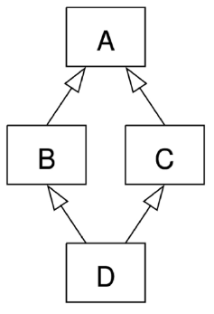

# 객체
## 클래스(Class)
: 파이썬에서 타입을 표현하는 방법
- 객체를 생성하기 위한 설계도
- 데이터와 기능을 함께 묶는 방법을 제공

## 객체(Object)
: 클래스에서 정의한 것을 토대로 메모리에 할당된 것
- **'속성'**과 **'행동'**으로 구성된 모든 것

### 클래스와 객체
- 클래스로 만든 객체를 **인스턴스**라고 부름
```python
name = 'Alice'

print(type(name))   # <class 'str'>

# 변수 name의 타입은 str 클래스다.
# 변수 name은 str 클래스의 인스턴스이다.
```
- 변수 name의 타입은 str 클래스다.
- 변수 name은 str **클래스의 인스턴스**이다.
- 문자열 타입(클래스)의 객체(인스턴스)
- "hello".upper()
    - 문자열.대문자로()
    - **객체.행동()**
    - **인스턴스.메서드()** # 메서드를 사용하려면 .을 찍으면 된다
- 하나의 객체(object)는 특정 타입의 인스턴스(instance)다.
    - 123, 900, 5는 모두 int의 인스턴스
    - 'hello', 'bye'는 모두 string의 인스턴스
    - [232, 89, 1], []은 모두 list의 인스턴스

### 객체 정리
- 타입(type): 어떤 연산자(operator)와 조작(method)이 가능한가?
- 속성(attribute): 어떤 상태(데이터)를 가지는가?
- 조작법(method): 어떤 행위(함수)를 할 수 있는가?

**객체(Object) = 속성(Attribute) + 기능(Method)**

# 클래스(Class)
: 파이썬에서 타입을 표현하는 방법
- 객체를 생성하기 위한 설계도
- 데이터와 기능을 함께 묶는 방법을 제공

### 클래스 정의
- 클래스 이름은 파스칼 케이스(Pascal Case) 방식으로 작성
    - `class MyClass:` 공백을 기준으로 대문자 사용

### 인스턴스 생성 및 활용
01-basic.py
```python
# 클래스 정의
class Person:
    blood_color = 'red'
    def __init__(self, name):
        self.name = name
    def singing(self):
        return f'{self.name}가 노래합니다.'


# 인스턴스 생성
singer1 = Person('iu')
# 메서드 호출
print(singer1.singing())  
# 속성(변수) 접근
print(singer1.blood_color)
```
- 메서드의 근본은 함수

## 클래스 구성요소
### 생성자 함수
: 객체를 생성할 때 자동으로 호출되는 특별한 메서드
- `__init__` 메서드로 정의되며, **객체 초기화**를 담당
```python
    def __init__(self, name):
        self.name = name
```
- 생성자 함수를 통해 인스턴스를 생성하고 필요한 초기값을 설정

### 인스턴스 변수
: 인스턴스마다 별도로 유지되는 변수
```python
        self.name = name
```
- 인스턴스마다 독립적인 값을 가지며, 인스턴스가 생성될 때마다 초기화됨

### 클래스 변수
: 모든 인스턴스가 공통으로 바라볼 변수
```python
class Person:
    blood_color = 'red'  # 클래스 변수
```
- 클래스 내부에 선언된 변수
- 클래스로 생성된 모든 인스턴스들이 공유하는 변수

### 인스턴스 메서드
: 각 인스턴스에서 호출할 수 있는 메서드
```python
    def singing(self):
        return f'{self.name}가 노래합니다.'
```
- 인스턴스 변수에 접근하고 수정하는 등의 작업을 수행

## 인스턴스 변수와 클래스 변수
- `class.class_varibale`로 클래스 변수 참조
```python
class Circle:
    pi = 3.14

    def __init__(self, r):
        self.r = r

c1 = Circle(5)
c2 = Circle(10)
```
- 우리가 사용하는 모든 원의 원주율은 3.14
- 하지만 반지름의 값은 원마다 다름
- 인스턴스 변수에는 각각의 다른 값
- 클래스 변수에는 같은 값
```python
Circle.pi = 5   # 클래스 변수 변경
print(Circle.pi)    # 5
print(c1.pi)        # 5
print(c2.pi)        # 5
```
```python
c2.pi = 5   # 인스턴스 변수 변경
print(Circle.pi)    # 3.14 (클래스 변수)
print(c1.pi)        # 3.14 (클래스 변수)
print(c2.pi)        # 5 (새로운 인스턴스 변수 생성)
```

# 메서드
### 메서드 종류
1. 인스턴스 메서드
2. 클래스 메서드
3. 정적 메서드
- 누가 호출할 것인가? 어떻게 정의할 것인가?

## 인스턴스 메서드
: 클래스로부터 생성된 각 인스턴스에서 호출할 수 있는 메서드 - 인스턴스의 상태를 조작하거나 동작을 수행
- 그냥 함수 정의하듯이 하면 됨
- 반드시 첫 번째 매개변수로 **인스턴스 자신(self)**을 전달받음
    - self는 매개변수 이름일 뿐이며 다른 이름으로 설정 가능
    - 하지만 다른 이름을 사용하지 않을 것을 강력히 권장
    - self는 호출할 때는 생략 가능

### self 동작 원리
- upper 메서드를 사용해 문자열 'hello'를 대문자로 변경
```python
'hello'.upper()
```
- 하지만 파이썬 내부 동작은 다음과 같이 진행
```python
str.uper('hello')
```
- str 클래스가 upper 메서드를 호출했고, 그 첫 번째 인자로 문자열 인스턴스가 들어간 것

**인스턴스 메서드의 첫 번재 매개변수가 반드시 인스턴스 자기 자신인 이유**
- `'hello.upper()'`은 `str.upper('hello')`를 **객체 지향 방식의 메서드로 호출하는 표현 (단축형 호출)**
- 'hello'라는 문자열 객체가 단순히 어딘가의 함수로 들어가는 인자로 활용되는 것이 아닌 객체 스스로 메서드를 호출하여 코드를 동작하는 객체지향적인 표현인 것

### 생성자 메서드
- 인스턴스 객체가 생성될 때 자동으로 호출되는 메서드
- 인스턴스 변수들의 초기값을 설정

## 클래스 메서드
: 클래스가 호출하는 메서드 - 클래스 변수를 조작하거나 클래스 레벨의 동작을 수행
- 인스턴스 메서드 만드는 거랑 똑같음 대신 `@classmethod` 데코레이터를 사용하여 정의
- 호출 시, 첫 번째 인자로 해당 메서드를 호출하는 클래스(cls)가 전달됨
```python
class MyClass:

    @classmethod
    def class_method(cls, arg1, ...):
        pass
```
- cls는 매개변수 이름일 뿐이며 다른 이름으로 설정 가능
- 하지만 다른 이름을 사용하지 않을 것을 강력히 권장

Q. person / address = 'earth' -> 'mars' 어떻게?

A. person.address = 'mars' 대신 클래스를 호출해서 바꿔주는 게 좀 더 명시적


## 정적 메서드
: 클래스와 인스턴스와 상관없이 독립적으로 동작하는 메서드 - 주로 클래스와 관련이 있지만 인스턴스와 상호작용이 필요하지 않은 경우에 사용
- 특정 개체만의 속성(클래스, 인스턴스가 가진 각각의 변수, 메서드)에 접근할 필요는 없지만, 우리가 만들어낸 클래스라는 모둠이라는 것 자체가 공통적으로 동작할 때 필요한 것들
- `@staticmethod` 데코레이터를 사용하여 정의
- 호출 시 필수적으로 작성해야 할 매개변수가 없음
```python
class MyClass:

    @staticmethod
    def static_method(arg1, ...):
        pass
```

## 인스턴스와 클래스 간 이름 공간(name space)
- 클래스를 정의하면, 클래스와 해당하는 이름 공간 생성
- 인스턴스를 만들면, 인스턴스 객체가 생성되고 **독립적인** 이름 공간 생성
- 인스턴스에서 특정 속성에 접근하면, 인스턴스 -> 클래스 순으로 탐색

- LEGB와는 다른 것

- `Person('iu').blood_color`를 치면 당연히 인스턴스에서 blood_color를 먼저 찾는다
- `Person('iu').blood_color=blue` 하면 오른쪽 iu 인스턴스 내부에 blood_color=blue라는 속성이 생김

# 상속
## 클래스 상속
### 상속 없이 구현하는 경우
- 학생/교수 정보를 별도로 표현하기 어려움
- 교수/학생 클래스로 분리했지만 메서드가 중복으로 정의될 수 있음
### 상속을 사용한 계층구조 변경


## 다중 상속
- 둘 이상의 상위 클래스로부터 여러 행동이나 특징을 상속받을 수 있는 것
- 상속받은 모든 클래스의 요소를 활용 가능함
- 중복된 속성이나 메서드가 있는 경우 **상속 순서에 의해 결정**됨
```python
class Person:
    def __init__(self, name):
        self.name = name
    def greeting(self):
        return f'안녕, {self.name}'

class Mom(Person):
    gene = 'XX'
    def swim(self):
        return '엄마가 수영'

class Dad(person):
    gene = 'XY'
    def walk(self):
        return '아빠가 산책'

class FirstChild(Dad, Mom):
    def swim(self):
        return '첫째가 수영'
    def cry(self):
        return '첫째가 응애'

baby1 = FirstChild('아가')
print(baby1.swim()) #첫째가 수영
print(baby1.gene)   #XY
```

### 다이아몬드 문제

- D는 B의 메서드 중 어떤 버전을 상속하는가? 아니면 C의 메서드 버전을 상속하는가?

#### 파이썬 해결책
- MRO(Method Resolution Order) 알고리즘을 사용하여 클래스 목록 생성
- 부모 클래스로부터 상속된 속성들의 검색을 C3 선형화 규칙에 맞춰 진행
- 계층 구조에서 겹치는 같은 클래스를 두 번 검색하지 않음
- 속성이 D에서 발견되지 않으면 B에서 찾고, 거기에서도 발견되지 않았으면, C에서 찾는 순으로 진행됨

```python
# C3 선형화
B D E O
C F D O
- B C 를 상속받은 A는?
- B 탐색 - 다음 D(head) - 근데 A가 상속 받은 C에 D가 존재 -> head(D)를 무시 -> 다음 head(C) 탐색 -> D와 F 중 head인 D 탐색 -> F D O에 D 존재 -> 무시 -> F 탐색 -> 그 다음 head D 탐색 -> 그 다음 E -> O
```
- `.__mro__`를 확인해보면 됨
### `super()`
: 부모 클래스(또는 상위 클래스)의 메서드를 호출하기 위해 사용하는 내장 함수
- 다중 상속 시 MRO(메서드 결정 순서)를 기반으로 현재 클래스가 상속하는 모든 부모 클래스 중 다음에 호출될 메서드를 결정하여 자동으로 호출
---
#### super 사용 전
```python
class Person:
    def __init__(self, name, age, number, email):
        self.name = name
        self.age = age
        self.number = number
        self.email = email

class Student(Person):
    def __init__(self, name, age, number, email):
        self.name = name
        self.age = age
        self.number = number
        self.student_id = student_id
```
#### super 사용 후
```python
class Person:
    def __init__(self, name, age, number, email):
        self.name = name
        self.age = age
        self.number = number
        self.email = email

class Student(Person):
    def __init__(self, name, age, number, email, student_id):
        # Person의 init 메서드 호출
        super().__init__(name, age, number, email)
        self.student_id = student_id
```
### MRO 필요한 이유
- 부모 클래스들이 여러 번 액세스되지 않도록 각 클래스에서 지정된 왼쪽에서 오른쪽으로 가는 **순서를 보존**하고, 각 부모를 오직 **한 번만 호출**하고, 부모들의 우선순위에 영향을 주지 않으면서 **서브 클래스**를 만드는 **단조적인 구조 형성**
- 신뢰성 있고 확장성 있는 클래스 설계 도움
- 클래스 간 메서드 호출 순서 예측 가능, 코드의 재사용성과 유지보수성 향상

### super()의 2가지 사용 사례
1. 단일 상속 구조
- 명시적으로 이름 지정 없이 부모 클래스 참조 -> 코드 유지 관리 더 쉬움
- 클래스 이름, 부모 클래스 변경되어도 코드 수정 적음
2. 다중 상속 구조
- MRO를 따른 메서드 호출
- 복잡한 다중 상속 구조에서 발생할 수 있는 문제 방지


# 클래스 참고
## 메서드 주의사항
### 어떤 메서드 사용?
- 클래스가 사용할 것
    - 클래스 메서드
    - 스태틱 메서드
- 인스턴스가 사용할 것
    - 인스턴스 메서드
### 클래스가 할 수 있는 것
- 클래스는 모든 메서드 호출 가능
- **하지만 클래스는 클래스와 메서드와 스태틱 메서드만 사용**
### 인스턴스가 할 수 있는 것
- 인스턴스는 모든 메서드 호출 가능
- **하지만 인스턴스는 인스턴스 메서드만 사용**

### 할 수 있다 != 써도 된다
- 각 메서드는 객체지향 패러다임에 따라 명확한 목적으로 설계
- 클래스와 인스턴스 각각 올바른 메서드만 사용

## 매직 메서드 (magic method)
- 인스턴스 메서드
- 특정 상황에 자동으로 호출되는 메서드
- Double underscore(__)가 있는 메서드는 특수한 동작을 위해 만들어진 메서드
- 스페셜 메서드 혹은 매직 메서드라고 불림
- inst1.foot_size와 inst2.foot_size 비교 결과를 내놓는 경우 ----- ?????

### 매직 메서드 예시
`__str__(self)` : 내장함수 print에 의해 호출되어 객체 출력을 문자열 표현으로 변경

## 데코레이터(Decorator)
- 다른 함수의 코드를 유지한 채로 수정하거나 확장하기 위해 사용되는 함수
- 함수 안의 함수


# 참고

## 제너레이터
### Iterator(이터레이터)
: 반복 가능한 객체의 요소를 하나씩 반환하는 객체
#### Python 내부적으로 반복이 작동하는 원리
#### [참고] 이터레이터 동작을 직접 클래스로 정의하는 방법

### Generator(제너레이터)
: 이터레이터를 간단하게 만드는 함수

#### 제너레이터를 사용하는 이유
1. 메모리 효율성
    - 한 번에 한 개의 값만 생성
    - 대용량 데이터 처리
2. 무한 시퀀스 처리
    - 무한 시퀀스 생성
3. 지연 평가 (Lazy Evaluation)
    - 필요할 때만 값 생성
    - 연산 지연

#### 제너레이터 구조
- 일반적인 함수처럼 작성
- yield문을 사용하여 값을 반환

#### 제너레이터 특징
- 클래스 기반 이터레이터 필요 없이 `__iter__()`, `__next__()` 메서드가 저절로 만들어짐
- `self.index`나 `self.data`와 같은 인스턴스 변수를 사용하는 접근법에 비교해 함수를 쓰기 쉽고 명료하게 만듦

#### return과 yield의 차이
----- 복습하십시오...
- `return`
    - 값을 반환하고 함수 실행 종료
    - 함수 호출마다 전체 함수 실행
    - 함수 상태는 호출 후 유지 안 됨
```python
def return_example():
    return 'a'
    return 'b'

print(return_example()) # a
```
- `yield`
    - 값을 반환하지만 함수 실행 종료 안 함
    - 함수의 현상태 유지하여, 이후 호출 시 중단 지점부터 실행
    - 제너레이터 객체 반환, 반복문 통해 순차적으로 값 반환 가능
```python
def yield_example():
    yield 'a'
    yield 'b'

gen = yield_example()
print(next(gen))    # a
print(next(gen))    # b
```
### 제너레이터 활용
#### 제너레이터의 메모리 효율성을 활용한 예시
1. 무한 시퀀스 생성
2. 대용량 데이터 처리

#### 제너레이터와 데이터 분석에서의 활용
- 추후 데이터 분석 시 큰 데이터를 한꺼번에 받아서(메모리에 올려서) 처리할 수 없는 경우 발생
- 데이터를 개발자가 원하는 양만큼만 가져와서 처리, 다시 그 양만큼만 가져와서 처리하는 행위 반복하여 데이터 분석 진행

### 제너레이터 관련
#### 제너레이터 표현식
- List Comprehesion과 비슷, 대괄호 대신 소괄호 사용 문법
- List Comprehesion보다 메모리 덜 씀
- 간결하지만 가독성 ↓
#### 제너레이터 주의사항
- 제너레이터 요소 모두 참조한 경우 재사용 불가
- 다시 제너레이터 함수 사용하여 변수에 재할당 필요


## 에러와 예외
----- 읽어보시길 바라지만 파이썬 공식 문서를 참고하십시오...
----- 특히 EOL, EOF는 대체되었으니 보지 마십시오...
## 예외 처리

### 예외에 대한 핸들링
- try
- except
- else
- finally

## 모듈
: 한 파일로 묶인 변수와 함수의 모음

: 특정한 기능을 하는 코드가 작성된 파이썬 파일(.py)

- 모듈들을 모아서 패키지라고 부름
## 파이썬 표준 라이브러리

### 패키지 활용
- 외부 패키지는 pip으로 설치

## 파일 읽고 쓰기
### 파일 읽기
### 파일 쓰기
### 바이너리 파일 처리
### CSV 파일 처리
### JSON 파일 처리

## 정규 표현식
: 문자열에서 특정 패턴을 찾기 위해 사용되는 기법
- 복잡한 문자열 속에서 특정한 규칙으로 된 문자열을 검색, 치환, 추출 등을 간결하게 수행할 수 있음

### 기본 패턴 매칭
### 정규 표현식 활용

## 참고
### 예외 객체 다루기
### 모듈 내부 살펴보기
### 유용한 정규 표현식 웹사이트