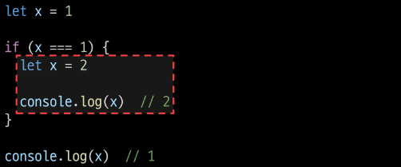

# DOM & Event

# History of JavaScript

## ECMAScript
: Ecma International이 정의하고 있는 표준화된 스크립트 프로그래밍 언어 명세
- 스크립트 언어가 준수해야 하는 규칙, 세부사항 등

### ECMAScript와 JavaScript
- ECMAScript는 JavaScript의 표준, Java는 ECMA 표준을 따르는 구체적인 프로그래밍 언어
- ECMA는 언어의 핵심을 정의하고, Java는 ECMA 표준을 따라 구현된 언어로 사용

### ECMAScript의 역사
- ECMAScript 2015(ES6)에서 객체지향 프로그래밍 언어로써 많은 발전을 이루어, 역사상 가장 중요한 버전으로 평가(2015)

# 변수데이터 타입

## 변수 선언 키워드

### 식별자(변수명) 작성 규칙
- 반드시 문자, 달러('$') 또는 밑줄('_')로 시작
- 대소문자 구분
- 예약어 사용 불가
    - for, if, function 등

### 식별자(변수명) Naming case
*(언급 안 함)*
- 카멜 케이스(camelCase)
    - 변수, 객체, 함수에 사용
- 파스칼 케이스(PascalCase)
    - 클래스, 생성자에 사용
- 대문자 스네이크 케이스(SNAKE_CASE)
    - 상수(constants)에 사용

### 변수 선언 키워드 3가지
1. let
2. const
3. ~~var~~

#### let
- **블록 스코프**(block scope)를 갖는 지역 변수를 선언
- 재할당 가능
- 재선언 불가능
- ES6에서 추가
```javascript
let number = 10 // 1. 선언 및 초기값 할당
number = 20     // 2. 재할당
```
```javascript
let number = 10 // 1. 선언 및 초기값 할당
let number = 20 // 2. 재선언 불가능
```
# *----- 재할당과 재선언의 차이가 무엇인가요...*

#### const
- **블록 스코프**를 갖는 지역 변수를 선언
- 재할당 불가능
- 재선언 불가능
- ES6에서 추가
```javascript
const number = 10   // 1. 선언 및 초기값 할당
number = 10         // 2. 재할당 불가능
```
```javascript
const number = 10   // 1. 선언 및 초기값 할당
const number = 20   // 2. 재선언 불가능
```
```javascript
const number    // const' declarations must be initialized.
```
- **선언 시 반드시 초기값 설정 필요**

#### 블록 스코프 (block scope)
- if, for, 함수 등의 '중괄호({}) 내부'를 가리킴
- 블록 스코프를 가지는 변수는 블록 바깥에서 접근 불가능


#### 어떤 변수 선언 키워드를 사용해야 할까?
- 기본적으로 `const` 사용 권장
- 재할당이 필요하면 그때 `let`으로 변경해서 사용

## 데이터 타입

### 원시 자료형(Primitive type)
: 변수에 값이 직접 저장되는 자료형(불변, 값이 복사)
- Number, String, Boolean, null, undefined
```javascript
const bar = 'bar'
console.log(bar)    // bar

bar.toUpperCase()
console.log(bar)    // bar
```
```javascript
let a = 10
let b = a
b = 20
console.log(a)      // 10
console.log(b)      // 20
```
- 변수에 할당될 때 값이 복사됨
- 변수 간에 서로 영향을 미치지 않음

#### Number
- 정수 또는 실수형 숫자를 표현하는 자료형
- `NaN`(Not a Number): 연산할 수 없는 연산을 진행했을 때

#### String
- 텍스트 데이터
- '+' 연산자를 사용해 문자열끼리 결합
- 뺄셈, 곱셈, 나눗셈 불가능

#### Template literals (템플릿 리터럴)
- 내장된 표현식을 허용하는 문자열 작성 방식
- Backtick(``)을 이용하며, 여러 줄에 걸쳐 문자열을 정의할 수도 있고 JavaScript의 변수를 문자열 안에 바로 연결할 수 있음
- 표현식은 `$`와 중괄호`${expression}`로 표기
```javascript
const age = 100
const message = `홍길동은 ${age}세입니다.`
console.log(message)    // 홍길동은 100세입니다.
```

#### null과 undefined
- null: 변수의 값이 없음을 의도적으로 표현할 때 사용
```javascript
let a = null
console.log(a)  // null
```
- undefined: 변수 선언 이후 직접 값을 할당하지 않으면 자동으로 할당됨
```javascript
let b
console.log(b)  // undefined
```

#### '값이 없음'에 대한 표현이 null과 undefined 2가지인 이유
- **JavaScript의 설계 실수**
- `null`이 원시 자료형임에도 불구하고 `object`로 출력되는 이유는 JavaScript 설계 당시의 버그를 해결하지 않은 것
- 해결하지 못한 이유는 이미 `null` 타입에 의존성을 띄고 있는 수많은 프로그램들이 망가질 수 있기 때문 (하위 호환 유지)
```javascript
typeof null         // "object"
typeof undefined    // "undefined"
```

#### Boolean; True/False
- 조건문 또는 반복문에서 Boolean이 아닌 데이터 타입은 "자동 형변환 규칙"에 따라 `true` 또는 `false`로 변환됨

#### 자동 형변환
| 데이터 타입 | false         | ture             |
|-------------|---------------|------------------|
| undefined   | 항상 false    | X                |
| null        | 항상 false    | X                |
| Number      | 0, -0, NaN    | 나머지 모든 경우 |
| String      | ''(빈 문자열) | 나머지 모든 경우 |

### 참조 자료형(Reference type)
: 객체의 주소가 저장되는 자료형(가변, 주소가 복사)
- Objects(Object, Array, Function)
```javascript
const obj1 = { name: 'Alice', age: 30 }
const obj2 = obj1
obj2.age = 40

console.log(obj1.age)   // 40
console.log(obj2.age)   // 40
```
- 객체를 생성하면 객체의 메모리 주소를 변수에 할당
- 변수 간에 서로 영향을 미침
# *p.27 const는 재할당 불가능이지 않았나요...*


# 연산자

### 할당 연산자
- +=, -=, *=, %=(나머지 반환)

### 증가 & 감소 연산자
*(있다 정도)*
- 증가 연산자 ('++')
    - 피연산자 증가(1을 더함)시키고 연산자 위치에 따라 증가하기 전이나 후의 값 반환

- 감소 연산자 ('--')
    - 피연산자 감소(1을 뺌)시키고 연산자의 위치에 따라 감소하기 전이나 후의 값을 반환

- '+=' 또는 '-='와 같이 더 명시적인 표현 작성 권장

### 비교 연산자
*(python이랑 똑같다)*
- 피연산자들(숫자, 문자, Boolean 등)을 비교하고 결과 값을 boolean으로 반환하는 연산자

### 동등 연산자(==)
- 암묵적 타입 변환까지 진행된다
```javascript
console.log('1' == 1)       // true
```

### 일치 연산자(===)
- 특수 경우 제외하고는 동등 연산자 아닌 **일치 연산자 사용 권장**
```javascript
console.log('1' === 1)      // false
```

### 논리 연산자
- and 연산 `&&`
- or 연산 `||`
- not 연산 `!`
- 단축 평가 지원

# 제어문
## 조건문

### if
```javascript
const name= 'customer'

if (name === 'admin') {
    console.log('관리자님 환영해요')
} else if (name === 'customer') {
    console.log('고객님 환영해요')
} else {
    console.log('반갑습니다. ${name}님')
}
```

### 삼항 연산자 (시험에 안 나옴 기억해두면 좋음)
```javascript
condition ? expression1 : expression2
```
- 이거 맞아 ? 응 : 아니


## 반복문
- while
- for
- for...in
- for...of

### while
*(파이썬이랑 똑같)*
```javascript
let i = 0

while (i < 6) {
    console.log(i)
    i += 1
}
```

### for
- 특정한 조건이 거짓으로 판별될 때까지 반복
```javascript
for (let i = 0; i < 6; i++) {
    console.log(i)
}
```

### for...in
- 객체의 열거 가능한 속성(property)에 대해 반복
    - 속성(property)은 값이 아니라 key
    - array(= ['a', 'b', 'c'])를 순회한다면 0, 1, 2가 출력
        - array -> {0: 'a', 1: 'b', 2: 'c'}로 할당
    - 하지만 순서가 없기 때문에 인덱스순으로 순회하는 것처럼 보여도 그렇지 않음
- object 순회할 때만 쓸 거
```javascript
const object = { a: 'apple', b: 'banana' }

for (const property in object) {
    console.log(property)   // a, b
    console.log(object[property])   // apple, banana
}
```
# *여기에서 나타난 object는 무엇인가...*

### for...of
- 반복 가능한 객체(배열, 문자열 등)에 대해 반복
```javascript
const numbers = [0, 1, 2, 3]

for (const number of numbers) {
    console.log(number) // 0, 1, 2, 3
}
```
- 배열의 요소가 직접 할당

### 배열 반복과 for...in
*(수업 시간 언급은 없었음)*

### 반복문 사용 시 const 사용 여부
*(수업 시간 언급은 없었음)*
- for 문
    - `for (let i = 0; i < arr.length; i++) {...}`
    - 최초 정의한 i를 "재할당"하면서 사용하기 때문에 const를  사용하면 에러 발생

- for...in, for...of
    - 재할당이 아니라, 매 반복마다 다른 속성 이름이 변수에 저장되는 것이므로 **const 사용해도 에러 발생 X**
    - 단, const 특징에 따라 블록 내부에서 변수 수정할 수 없음

### 반복문 종합
| 키워드 | 특징 | 스코프 | 
| --- | --- | --- |
| while | . |블록 스코프 |
| for | . |블록 스코프 |
| for...in | object 순회 |블록 스코프 |
| for...of | iterable 순회 | 블록 스코프 |


# DOM

### DOM tree

### 브라우저가 웹 페이지를 불러오는 과정

### DOM 핵심
: 문서의 요소들을 객체로 제공하여 다른 프로그래밍 언어에서 접근하고 조작할 수 있는 방법을 제공하는 API

## document 객체
: 웹 페이지 객체
: DOM Tree의 진입점
- 페이지를 구성하는 모든 객체 요소를 포함


# DOM 선택

### DOM 조작 시 기억해야 할 것
**웹 페이지를 동적으로 ...

## 선택 메서드
- `document.querySelector()`
    - 요소 한 개 선택
- `document.querySelectorAll()`
    - 요소 여러 개 선택

### `document.querySelector(selector)`
-----

### `document.querySelectorAll(selector)`
: 제공한 선택자와 일치하는 여러 element를 선택
- 제공한 CSS selector를 만족하는 NodeList를 반환

### DOM 선택 실습


# DOM 조작
1. 속성(attribute) 조작
    - 클래스 속성 조작
    - 일반 속성 조작
2. HTML 콘텐츠 조작
3. DOM 요소 조작
4. 스타일 조작

## 속성 조작

### 클래스 속성 조작
`classList` property
: 
### 1. classList method

### 클래스 속성 조작 실습

### 2. 일반 속성 조작 메서드

### 일반 속성 조작 실습


## HTML 콘텐츠 조작
`textContent1` property
:
### HTML 조작 실습????

## DOM 요소 조작

### DOM 요소 조작 메서드

## style 조작
`style` property
: 

### style 조작 실습
----- 왜 안 쓸까? 스타일 조작 어케 해야할까? 고민해보삼

# 참고
----- 한 번쯤 읽어보시면 좋을 거 가태요


# 함수
Function: 참조 자료형에 속하며 모든 함수는 `Function` object

## 함수 정의

### 함수 구조
```javascript
```
- `function` 키워드
- 함수의 이름
- 함수의 매개변수
- 함수의 body를 구성하는 statments
- **return 값이 없으면 undefined 반환**

### 함수 정의 2가지 방법

선언식 vs 표현식

#### 선언식
```javascript
```

#### 표현식
```javascript
```

### 함수 표현식 특징


## 매개변수

### 매개변수 정의 방법

### 1. 기본 함수 매개변수 ()

### 매개변수와 인자 개수가 불일치 할 때
- 누락된 인자는 undefined로 할당
- 초과 입력한 인자는 사용하지 않음

### 2. 


## Spread syntax

`...` (Spread syntax): 전개 구문

### 전개 구문 활용처
1. 함수와의 사용
2. 객체와의 사용
-----

### 전개 구문 활용


## 화살표 함수
화살표 함수 표현식(Arrow function y)

### 화살표 함수 작성 결과
```javascript
```
```javascript
```

### 화살표 함수 작성 과정
1. **function 키워드 제거 후 매개변수와 중괄호 사이에 화살표(=>) 작성**
2. ----- 나머지는 걍 잘 확인해보시길

### 화살표 함수 심화

## 참고

### 세미콜론
- 자바스크립트는 문장 마지막 세미콜론(';')을 선택적으로 사용 가능
- 세미콜론이 없으면 ASI에 의해 자동으로 세미콜론이 삽입됨
- JavaScript를 만든 Brendan Eich 또한 세미콜론 작성을 반대


# 이벤트

### 일상 속의 이벤트

### 웹에서의 이벤트


## event 객체

### event
: 무언가 일어났다는 신호, 사건
- -----

### `event` object
: DOM에서 이벤트가 발생했을 때 생성되는 객체
- 이벤트 종류
    - mouse, input, keyboard, touch ...

**DOM 요소는 event를 받고 받은 event를 '처리'할 수 있음**


## event handler
: 이벤트가 발생했을 때 실행되는 함수
- 사용자의 행동에 어떻게 반응할지를 JavaScript 코드로 표현한 것

### `.addEventlistener()`
대표적인 ----- 이거 무시하는 멘트
- 특정 이벤트를 DOM 요소가 수신할 때마다 콜백 함수를 호출
```javascript
EventTarget.addEventListener(type, handler)
// EventTarget - DOM 요소
// type - 수신할 이벤트
```
"대상에 특정 Event가 발생하면, -----"

### addEventListener 활용
-=---


## 버블링

### 버블링 개요


# event handler 활용


# 이벤트 기본 동작 취소
----- 이건 꼭 알고 가면 좋겠다
- HTML의 각 요소가 기본적으로 가지고 있는 이벤트가 때로는 방해가 되는 경우가 있어 이벤트의 기본 동작을 취소할 필요가 있음
- 예시
    - form 요소의 제출 이벤트를 취소하여 -----

### `.preventDefault()`
: 해당 이벤트에 대한 기본 동작을 실행하지 않도록 지정