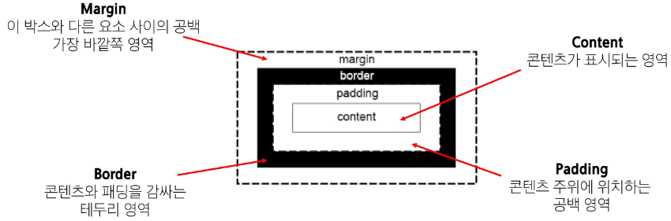
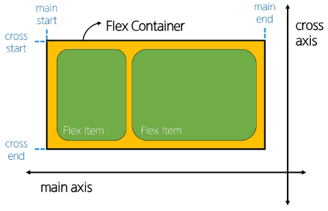
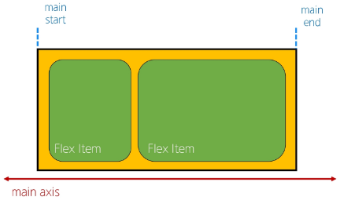
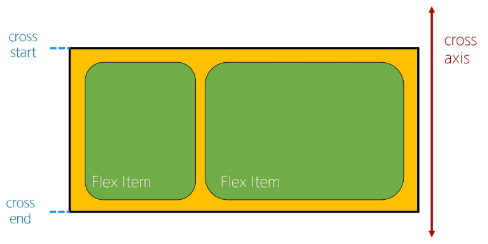

# CSS Box Model
: 웹 페이지의 모든 HTML 요소를 감싸는 사각형 상자 모델

## 박스 타입

----- 지난 시간 내용 참고하세요...

inline
- 부모 요소의 높이를 따라감

## 박스 구성 요소

## shorthand 속성
- 'border'
- border-width, border-style, border-color를 한 번에 설정하기 위한 설정
-- 작성 순서는 영향을 주지 않음
- 'margin' & 'padding'
- 4방향의 속성을 각각 지정하지 않고 한 번에 지정할 수 있는 속성
-- 4개 상우하좌 / 3개 상 좌우 하 / 2개 상하 좌우 / 1개 공

## box-sizing 속성

## 기타 display 속성

# CSS position

## Position 유형
1. static
2. relative 상대적 --- 본인 공간 유지 후 이
3. absolute 절대적 ---- 본인 공간 없앰
4. fixed 고정
5. sticky 끈적끈

## z-index

-static이 아닌 요소에만 적용됨

### Position의 목적
: 전체 페이지에 대한 레이아웃을 구성하는 것보다는 **페이지 특정 항목의 위치를 조정**하는 것

# CSS Flexbox
: 요소를 행과 열 형태로 배치하는 1차원 레이아웃 방식
- '공간 배열' & '정렬'

## Flexbox 구성 요소

- 자손이 아니라 자식에게만 나타남 ----- 듣고 다시 확인해보시죠......

### main axis (주 축)
- flex item들이 배치되는 기본 축
- main start에서 시작하여 main end 방향으로 배치 (기본 값)

### cross axis

### Flex Container

### Flex Item

## Flexbox 속성

### Flexbox 속성 목록

## flex-wrap 응용

### 반응형 레이아웃
: 다양한 디바이스와 화면 크기에 자동으로 적응하여 콘텐츠를 최적으로 표시하는 웹 레이아웃 방식

# 참고

## 마진 상쇄

## 박스 타입별 수평 정렬

## 실제 Position 활용 예시

## Flexbox Shorthand 속성

## Flexbox 속성 정리