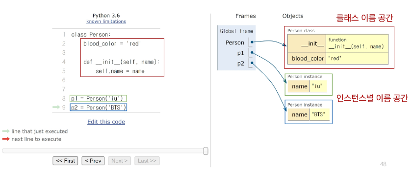
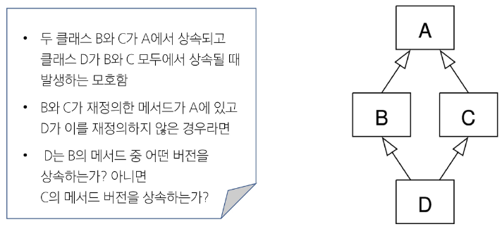

# 객체
## 클래스
- 파이썬에서 타입을 표현하는 방법
- 객체를 생성하기 위한 설계도
- 데이터와 기능을 함께 묶는 방법을 제공

## 객체
- 클래스에서 정의한 것을 토대로 메모리에 할당된 것
- **'속성'**과 **'행동'**으로 구성된 모든 것

### 클래스와 객체
- 문자열 타입(클래스)의 객체(인스턴스)
- "hello".upper()
    - 문자열.대문자로()
    - 객체.행동()
    - 인스턴스.메서드() # 메서드를 사용하려면 .을 찍으면 된다

### 객체 정리
- 타입(type): 어떤 연산자(operator)와 조작(method)이 가능한가?
- 속성(attribute): 어떤 상태(데이터)를 가지는가?
- 조작법(method): 어떤 행위(함수)를 할 수 있는가?
- **객체(Object) = 속성(Attribute) + 기능(Method)**

## 클래스
- 파이썬에서 타입을 표현하는 방법
- 객체를 생성하기 위한 설계도
- 데이터와 기능을 함께 묶는 방법을 제공

### 클래스 정의
- 클래스 이름은 파스칼 케이스(Pascal Case) 방식으로 작성
    - `class MyClass:` 공백을 기준으로 대문자 사용

---
01-basic.py
```python
# 클래스 정의
class Person:
    blood_color = 'red'
    def __init__(self, name):
        self.name = name
    def singing(self):
        return f'{self.name}가 노래합니다.'


# 인스턴스 생성
singer1 = Person('iu')
# 메서드 호출
print(singer1.singing())  
# 속성(변수) 접근
print(singer1.blood_color)
```
- 메서드의 근본은 함수
---

### 생성자 함수
- 객체를 생성할 때 자동으로 호출되는 특별한 메서드
- `__init__` 메서드로 정의되며, **객체 초기화**를 담당

### 인스턴스 변수
```python
        self.name = name
```
- 인스턴스마다 별도로 유지되는 변수
- 인스턴스마다 독립적인 값을 가지며, 인스턴스가 생성될 때마다 초기화됨

### 클래스 변수
- `blood_color = 'red'`
- 모든 인스턴스가 공통으로 바라볼 변수
- 클래스 내부에 선언된 변수
- 클래스로 생성된 모든 인ㅇ스턴스들이 공유하는 변수

### 인스턴스 메서드
```python
    def singing(self):
        return f'{self.name}가 노래합니다.'
```

### 인스턴스 변수와 클래스 변수

우리가 사용하는 모든 원의 원주율은 3.14
하지만 반지름의 값은 원마다 다름
인스턴스 변수에는 각각의 다른 값
클래스 변수에는 같은 값

## 메서드
1. 인스턴스 메서드
2. 클래스 메서드
3. 정적 메서드
- 누가 호출할 것인가? 어떻게 정의할 것인가?

### 인스턴스 메서드
- 클래스로부터 생성된 각 인스턴스에서 호출할 수 있는 메서드
- 그냥 함수 정의하듯이 하면 됨
- 반드시 첫 번째 매개변수로 인스턴스 자신(self)을 전달받음
    - self는 매개변수 이름일 뿐이며 다른 이름으로 설정 가능
    - 하지만 다른 이름을 사용하지 않을 것을 강력히 권장
    - self는 호출할 때는 생략 가능

#### self 동작 원리
----- 읽어보십시다...

#### 생성자 메서드
- 인스턴스 객체가 생성될 때 자동으로 호출되는 메서드
- 인스턴스 변수들의 초기값을 설정

### 클래스 메서드
- 클래스가 호출하는 메서드
    - 클래스 변수를 조작하거나 클래스 레벨의 동작을 수행
- 인스턴스 메서드 만드는 거랑 똑같음 대신 `@classmethod` 데코레이터를 사용하여 정의
- 호출 시, 첫 번째 인자로 해당 메서드를 호출하는 클래스(cls)가 전달됨

person / address = 'earth' -> 'mars' 어떻게?
person.address = 'mars' 대신 클래스를 호출해서 바꿔주는 게 좀 더 명시적


### 정적 메서드
- 클래스와 인스턴스와 상관없이 독립적으로 동작하는 메서드
    - 클래스가 가진 속성, 메서드, 인스턴스가 가진 변수, 메서드에 접근할 필요는 없지만, 특정 개체만의 속성에 접근할 필요는 없지만, 우리가 만들어낸 클래스라는 모둠이라는 것 자체가 공통적으로 동작할 때 필요한 것들
    - 주로 클래스와 관련이 있지만 인스턴스와 상호작용이 필요하지 않은 경우에 사용

## 인스턴스와 클래스 간 이름 공간(name space)
- 클래스 생성하면
- 인스턴스를 만들면, 인스턴스 객체가 생성되고 독립적인 이름 공간 생성
- 인스턴스에서 특정 속성에 접근하면, 인스턴스 -> 클래스 순으로 탐색
- LEGB와는 다른 것


- `Person('iu').blood_color`를 치면 당연히 인스턴스에서 blood_color를 먼저 찾는다
- `Person('iu').blood_color=blue` 하면 오른쪽 iu 인스턴스 내부에 blood_color=blue라는 속성이 생김

## 상속
### 다중 상속
- 둘 이상의 상위 클래스로부터 여러 행동이나 특징을 상속받을 수 있는 것
- 상속받은 모든 클래스의 요소를 활용 가능함
- 중복된 속성이나 메서드가 있는 경우 **상속 순서에 의해 결정**됨

#### 다이아몬드 문제


- C3 선형화
    - B D E O
    - C F D O
    - B C 를 상속받은 A는?
    - B 탐색 - 다음 D(head) - 근데 A가 상속 받은 C에 D가 존재 -> head(D)를 무시 -> 다음 head(C) 탐색 -> D와 F 중 head인 D 탐색 -> F D O에 D 존재 -> 무시 -> F 탐색 -> 그 다음 head D 탐색 -> 그 다음 E -> O

    -`.__mro__`를 확인해보면 됨

-  `super()`: 부모 클래스(또는 상위 클래스)의 메서드를 호출하기 위해 사용하는 내장 함수
    - 다중 상속 시 MRO를 기반으로 현재 클래스가 상속하는 모든 부모 클래스 중 다음에 호출될 메서드를 결정하여 자동으로 호출
---
#### super 사용 전
```python
class Person:
    def __init__(self, name, age, number, email):
        self.name = name
        self.age = age
        self.number = number
        self.email = email

class Student(Person):
    def __init__(self, name, age, number, email):
        self.name = name
        self.age = age
        self.number = number
        self.student_id = student_id
```
#### super 사용 후
```python
class Person:
    def __init__(self, name, age, number, email):
        self.name = name
        self.age = age
        self.number = number
        self.email = email

class Student(Person):
    def __init__(self, name, age, number, email, student_id):
        # Person의 init 메서드 호출
        super().__init__(name, age, number, email)
        self.student_id = student_id
```
---
## 참고
### 클래스가 할 수 있는 것
- 클래스는 모든 메서드를 호출할 수 있음
- **하지만 클래스는 클래스와 메서드와 스태틱 메서드만 사용하도록 한다.**
### 인스턴스가 할 수 있는 것
----- 읽어보시오...

### 할 수 있다 != 써도 된다

### 매직 메서드 (magic method)
- 인스턴스 메서드
- 특정 상황에 자동으로 호출되는 메서드
- Double underscore(__)가 있는 메서드는 특수한 동작을 위해 만들어진 메서드
- 스페셜 메서드 혹은 매직 메서드라고 불림
- inst1.foot_size와 inst2.foot_size 비교 결과를 내놓는 경우

#### `__str__(self)`

### 데코레이터(Decorator)
- 다른 함수의 코드를 유지한 채로 수정하거나 확장하기 위해 사용되는 함수
- 함수 안의 함수

# 정규 표현식
- 문자열에서 특정 패턴을 찾기 위해 사용되는 기법
- 복잡한 문자열 속에서 특정한 규칙으로 된 문자열을 검색, 치환, 추출 등을 간결하게 수행할 수 있음

# 참고

## 제너레이터

### 제너레이터를 사용하는 이유
1. 메모리 효율성
2. 무한 시퀀스 처리
----- 읽어보시오...

### return과 yield의 차이
----- 복습하십시오...

## 에러와 예외
----- 읽어보시길 바라지만 파이썬 공식 문서를 참고하십시오...
----- 특히 EOL, EOF는 대체되었으니 보지 마십시오...

### 예외에 대한 핸들링
- try
- except
- else
- finally

## 모듈
- 한 파일로 묶인 변수와 함수의 모음
- 특정한 기능을 하는 코드가 작성된 파이썬 파일(.py)

- 모듈들을 모아서 패키지라고 부름

### 패키지 활용
- 외부 패키지는 pip으로 설치
- 