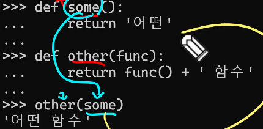

python 배우는 이유
- 쉽고 간결
- 파이썬 커뮤니티 지원
- 광범위한 응용 분야
알고리즘 구현에 유리한 python
- 직관적인 문법
- 강력한 표준 라이브러리
- 빠른 프로토타이핑

run 대신 `python 파일명.py`로 실행

데이터 타입 분류
Numeric - int, float
Text Sequence
Sequence
Non-sequence
기타

## sequence
- 문자들의 순서가 있는 변경 불가능한 시퀀스 자료형
- 문자열은 단일 문자나 여러 문자의 조합으로 이뤄짐
- 작은따옴표, 큰따옴표로 감싸서 표현

f-string
- 문자열에 f 또는 F 접두어를 붙이고 표현식을 {expression}로 작성하여 문자열에 파이썬 표현식의 값을 삽입
- {} 안에는 복잡한 연산식 대신 값이 할당된 변수만 사용

문자열의 시퀀스 특징
```python
my_str = 'hello'
# 인덱싱
print(my_str[1])   # e
# 슬라이싱
print(my_str[2:4])   # ll
```

hello - 0(-5), 1(-4), 2(-3), 3(-2), 4(-1)

슬라이싱

`my_str[:3]   # hell`

`my_str[3:]   # lo`

`my_str[0:5:2]   #hlo`

`my_str[::-1]   # olleh`

문자열 조작 메서드 (새 문자열 반환)

s.replace(old, new[,count])   # 바꿀 대상 글자를 새로운 글자로 바꿔서 반환

s.strip([chars])   # 공백이나 특정 문자를 제거

### list
- 여러 개의 값을 순서대로 저장하는 변경 가능한 시퀀스 자료형
- 0개 이상의 객체를 포함하며 데이터 목록을 저장
- 대괄호 []
- 어떠한 자료형도 저장할 수 있음

- 리스트는 가변 (변경 가능)
```python
my_list = [1, 2, 3]
my_list[0] = 100

print(my_list)   # [dd]
```
L.append(x)   # 리스트 마지막 항목 x를 추가
L.extend(m)   # Iterable m의 모든 항목들을 리스트 끝에 추가 (+=과 같은 기능)
L.pop(i)   # 리스트 가장 오른쪽에 있는 항목(마지막)을 반환 후 제거
L.pop으로는 인덱싱 안 할 거 -> 이유는 알고리즘에서

L.reverse()   # 리스트의 순서를 역순으로 변경 (정렬 X)
L.sort()   # 리스트를 정령 (매개변수 이용가능)

### tuple
- 여러 개의 값을 순서대로 저장하는 **변경 불가능**한 시퀀스 자료형
- 목적: 개발자가 직접 사용하기보다 '파이썬 내부 동작'에서 주로 사용됨
- 불변 (변경 불가)

### range
- 연속된 정수 시퀀스를 생성하는 변경 불가능한 자료형
- range(시작 값, 끝 값, 증가 값)
- range(n) - 0부터 n-1까지의 숫자의 시퀀스
- range(n, m) - n부터 m-1까지의 숫자 시퀀스
- range(5) = (0, 1, 2, 3, 4) / range(2, 4) = (2, 3)
- 증가 값이 없으면 1씩 증가
- 증가 값 음수면 감소 - 이 경우 시작 값이 끝 값보다 커야함 / 양수면 증가
- 증가 값이 0이면 에러
- range 활용 예시 - 주로 반복문과 함께 활용

## Non-Sequence
### dictionary
- key-value 쌍으로 이루어진 순서와 중복이 없는 변경 가능한 자료형
- key는 변경 불가능한 자료형만 사용 가능 (str, int, float, tuple, range, ...)
- value는 모든 자료형 사용 가능
- 중괄호({})로 표기 - `{'key': 'value'}`
- value 가져오고 싶으면 `print(딕셔너리명['key'])` -- key가 없다면 key error 발생

#### method
- D.get(k) - 키 k에 연결된 값을 반환 (키가 없으면 None을 반환)

### set
- 순서와 중복이 없는 변경 가능한 자료형
- 수학에서의 집합과 동일한 연산 처리 가능
- 중괄호({})로 표기
- 비어있는 set 만들고 싶으면 `my_set = set()`
- `my_set = {1, 1, 1}   # {1}`
- 합집합 print(set1 | set2)
#### method
- s.add(x)   # 세트 s에 항목 x를 추가. 이미 x 있다면 변화 없음
- s.remove(x)   # 세트 s에서 항목 x를 제거. 항목 x가 없을 경우 Key error

**순서와 중복이 없는** -> 파이썬 출력 시 임의로 순서 맞게 출력하도록 입력된 것

순서가 있는 딕셔너리는 ordered dict 있음

## 기타
### None
- 파이썬에서 '값이 없음'을 표현하는 자료형
0 - int
[] - 비어있는 리스트
'' - 비어있는 문자열
{} - 비어있는 딕셔너리
set() - 비어있는 세트
요소가 없는 값들

### Boolean
- 첫 글자만 대문자로 쓰셈

### 복사
#### 데이터 타입과 복사
- 파이썬에서는 데이터의 분류에 따라 복사가 달라짐

##### 변경 가능한 데이터 타입의 복사
```python
a = [1, 2, 3, 4]
b = a
b[0] = 100

print(a)   # [100, 2, 3, 4]
print(b)   # [100, 2, 3, 4]
```
##### 변경 불가능한 데이터 타입의 복사
--

#### 복사 유형
1. 할당 (Assignment)
2. 얕은 복사 (Swallow copy)
3. 깊은 복사 (Deep copy)

##### 할당
- 할당 연산자(=)를 통한 복사는 해당 객체에 대한 **객체 참조를 복사**

##### 얕은 복사
```python
a = [1, 2, 3]
b = a[:]

b[0] = 100
print(a, b)   # [1, 2, 3], [100, 2, 3]
```
- 2차원 리스트와 같이 변경 가능한 객체 안에 변경 가능한 객체가 있는 경우
```python
a = [1, 2, [1, 2]]
b = a[:]

b[2][0] = 100
print(a, b)   # [1, 2, [100, 2]], [1, 2, [100, 2]]
```
- a 안의 [1, 2] 리스트를 내부에서 동시에 참조하므로 같이 변환됨

##### 깊은 복사
```python
import copy
copy.deepcopy(dd)
```

### 형변환

#### 암시적 형변환

#### 명시적 형변환

p.109 표 참조

### 연산자

#### 산술 연산자

#### 복합 연산자

#### 비교 연산자
- ==, !=, is, is not - ==/!=는 일반적인 같냐 아니냐, is/is not은 특수한 상황

#### 논리 연산자

#### 단축평가

#### 멤버십 연산자
- in, not in
- 특정 값이 시퀀스나 다른 컬렉션에 속하는지 여부를 확인

#### 시퀀스형 연산자
- '+' (결합 연산자), '*' (반복 연산자)

## 제어문
- 코드의 실행 흐름을 제어하는 데 사용되는 구문
- **조건**에 따라 코드 블록을 실행하거나 **반복**적으로 코드를 실행
- 조건문 - if, elif, else
- 반복문 - for, while
- 반복문 제어 - break, continue, pass
--- for문과 while문을 편하게 변형 가능하도록 연습해보기

### 조건문
```python
if 표현식:
    코드 블록
elif 표현식:
    코드 블록
else:
    코드 블록
```

### 반복문

#### for
- 임의의 시퀀스의 항목들을 그 시퀀스에 들어있는 순서대로 반복
- 반복문에 시퀀스 아닌 것도 넣을 수 있음 -- 반복 가능한 객체(iterable): 반복문에서 순회할 수 있는 객체(시퀀스 객체 뿐만 아니라 dict, set 등도 포함)

인덱스로 리스트 순회 -- 리스트의 요소가 아닌 인덱스로 접근하여 해당 요소들을 변경하기

중첩 리스트 순회 - 안쪽 리스트 요소에 접근하려면 바깥 리스트를 순회하면서 중첩 반복을 사용해 각 안쪽 반복을 순회
----- 연습해보삼요...

#### while
- 주어진 조건식이 참(True)인 동안 코드를 반복해서 실행
== 조건식이 거짓(False)이 될 때까지 반복
```python
while 조건식:
    코드 블록
```

#### 반복 제어
---- 읽어보셈요...

#### List Comprehension
- 간결하고 효율적인 리스트 생성 방법

`[expression for 변수 in iterable]`

`[expression for 변수 in iterable if 조건식]` - 비추

## 함수
- 매개변수 parameter (input x)
- 함수 내부 code block function body
- 무조건 return 값 있음 return value (output x) - return 안 쓰면 자동으로 None 넣어서 출력함
- 특징
    - def 키워드를 사용하여 정의
    - 일급 객체
        - 함수가 변수에 할당될 수 있음
        - 함수가 다른 함수의 인자로 전달될 수 있음
        - 함수가 다른 함수에 의해 반환될 수 있음
    - 익명 함수로 사용 가능 (람다 표현식)


### 매개변수와 인자
매개변수와 인자 간 구분
- 매개변수(parameter): 함수를 정의할 때, 함수가 받을 값을 나타내는 변수
- 인자(argument): 함수를 호출할 때, 실제로 전달되는 값

#### 다양한 인자 종류
1. 위치 인자:
    - 함수 호출 시 인자의 위치에 따라 전달되는 인자
    - **위치인자는 함수 호출 시 반드시 값을 전달해야 함**
2. 기본 인자 값:
    - 함수 정의에서 매개변수에 기본 값을 할당하는 것
    - 함수 호출 시 인자를 전달하지 않으면, 기본값이 매개변수에 할당됨
3. 키워드 인자:
    - 함수 호출 시 인자의 이름과 함께 값을 전달하는 인자
    - 매개변수와 인자를 일치시키지 않고, 특정 매개변수에 값을 할당할 수 있음
    - **인자의 순서는 중요하지 않으며**, 인자의 이름을 명시하여 전달
    - **단, 호출 시 키워드 인자는 위치 인자 뒤에 위치해야 함**
4. 임의의 인자 목록
    - 정해지지 않은 개수의 인자를 처리하는 인자
    - 함수 정의 시 매개변수 앞에 '*'를 붙여 사용, 여러 개의 인자를 tuple로 처리
5. 임의의 키워드 인자 목록
    - 정해지지 않은 개수의 키워드 인자를 처리하는 인자
    - 함수 정의시 매개변수 앞에 '**'를 붙여 사용, 여러 개의 인자를 dictionary로 묶어 처리

함수 인자 권장 작성순서
- 위치 -> 기본 -> 가변 -> 가변 키워드
- `def func(pos1, pos2, default_arg='default', *args, **kwargs) ...`

#### Packing & Unpacking (인자 입력 방식)
----- ㄷㅏ시 보고 정리하셈요...

### 내장 함수
- len, max, min, sum, sort
----- 위에 함수 쓰지말고 for/if 사용해서 찾는 거 해보삼요...

#### zip 활용

#### 람다 표현식
- 익명 함수
----- 한 번쯤 써보시는 것을 추천함요...

## 참고

### Style Guide
- 코드의 일관성과 가독성을 향상시키기 위한 규칙과 권장 사항들의 모음

----- 나머지 읽어보삼요...

### LEGB Rule
----- 반드시 읽어보삼요...